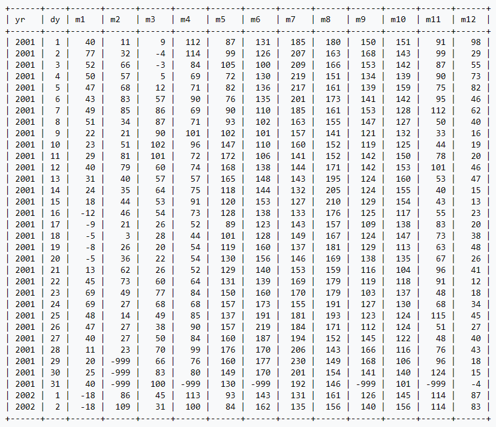

# Challenges

Only one challenge, so no ToC.

## White Christmas (last edited 12/08/2025)

- <https://sqlzoo.net/wiki/White_Christmas>

The HadCET table

<div align="center">

  

</div>


### 1. Days, Months and Years

The units are 10th of a degree Celcius. The columns are yr and dy for year and day of month. The next twelve columns are for January through to December.

**Show the average daily temperature for August 10th 1964**

```SQL
SELECT m8/10
  FROM hadcet
 WHERE yr = 1964
   AND dy = 10
```

---


### 2. preteen Dickens

Charles Dickens is said to be responsible for the tradition of expecting snow at Christmas [Daily Telegraph](http://www.telegraph.co.uk/topics/christmas/3933091/Dreaming-of-a-white-Christmas-Blame-the-nostalgia-of-Charles-Dickens-snowy-childhood.html). Show the temperature on Christmas day (25th December) for each year of his childhood. He was born in February 1812 - so he was 1 (more or less) in December 1812.

**Show the twelve temperatures.**

```SQL
SELECT ROW_NUMBER() OVER (ORDER BY yr ASC) AS AGE,
       m12/10
  FROM hadcet
 WHERE dy = 25
   AND yr BETWEEN 1812 AND 1812 + 11
```

---


### 3. Minimum Temperature Before Christmas

We declare a White Christmas if there was a day with an average temperature below zero between 21st and 25th of December.

**For each age 1-12 show which years were a White Christmas. Show 'White Christmas' or 'No snow' for each age.**

```SQL
SELECT ROW_NUMBER() OVER (ORDER BY yr ASC) AS AGE,
       CASE WHEN MIN(m12) < 0 THEN "White Christmas" ELSE "No Snow" END AS white_or_no
  FROM hadcet
 WHERE dy BETWEEN 21 AND 25
   AND yr BETWEEN 1812 AND 1812 + 11
 GROUP BY yr
```

---


### 4. White Christmas Count

A person's White Christmas Count (wcc) is the number of White Christmases they were exposed to as a child (between 3 and 12 inclusive assuming they were born at the beginning of the year and were about 1 year old on their first Christmas).

Charles Dickens's wcc was 8.

List all the years and the wcc for children born in each year of the data set. Only show years where the wcc was at least 7.

```SQL
WITH childhood_winter_christmases AS(
  SELECT yr AS yob,
         SUM(
           CASE WHEN MIN(m12) < 0 THEN 1 ELSE 0 END
         ) OVER (ORDER BY yr ASC ROWS BETWEEN 2 FOLLOWING AND 11 FOLLOWING) AS wcc
    FROM hadcet
   WHERE dy BETWEEN 21 AND 25
   GROUP BY yr
)

SELECT *
  FROM childhood_winter_christmases
 WHERE wcc >= 7
```

> Alternative query (answer from SQLZoo) but it seems (*way*) worse(ly nested) of a query in my opinion?
>
> ```SQL
> SELECT * FROM (
>   SELECT yob, COUNT(CASE WHEN mt < 0 THEN 1 END) AS wcc FROM (
>     SELECT yob, yr - yob - 1 as age, MIN(m12) AS mt
>       FROM hadcet JOIN (SELECT DISTINCT yr AS yob
>                           FROM hadcet) AS yrs
>      WHERE yr BETWEEN yob + 2 AND yob + 11
>        AND dy BETWEEN 21      AND 25
>       GROUP BY yob, age) AS yam
>    GROUP BY yob) AS ywcc
>  WHERE wcc >= 7
> ```

---


### 5. Climate Change

Here are the average temperatures for August by decade. You decide.

```SQL
SELECT ROUND(yr, -1) decade, ROUND(AVG(NULLIF(m8, -999)) / 10, 1)
  FROM hadcet
 GROUP BY ROUND(yr, -1)
```

---
