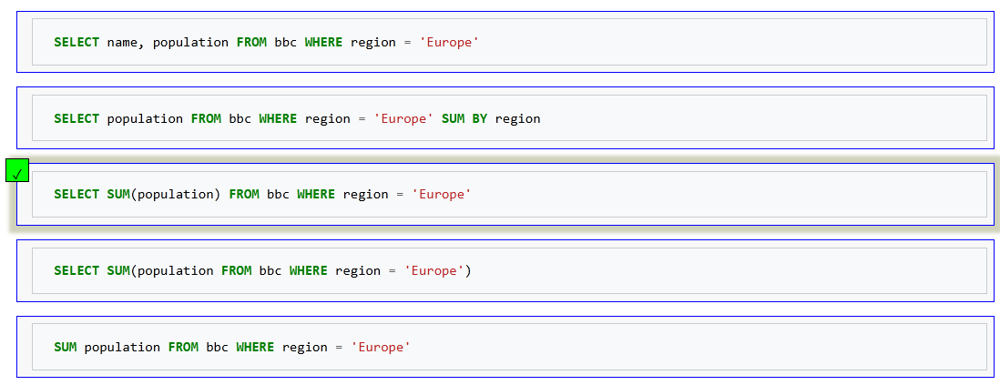
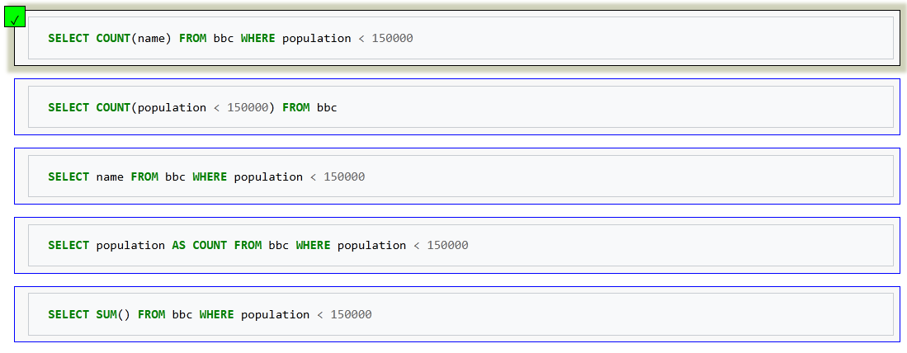
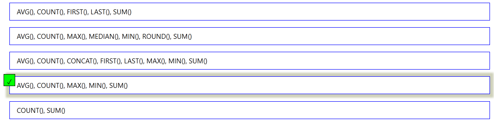
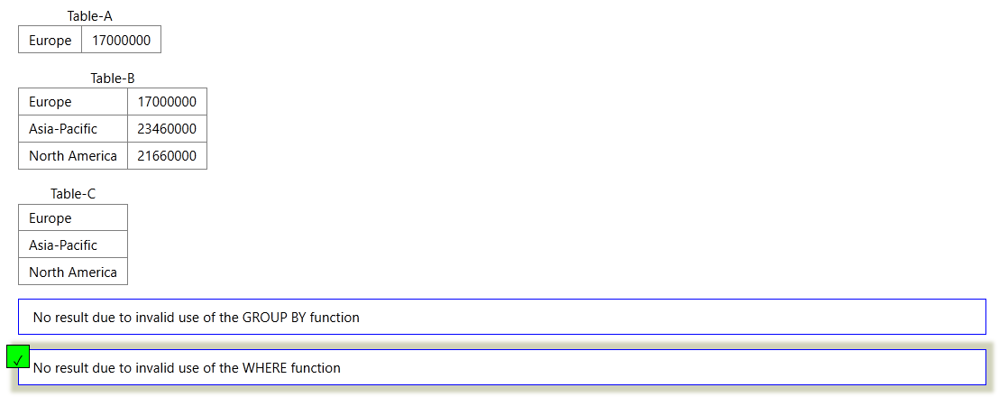
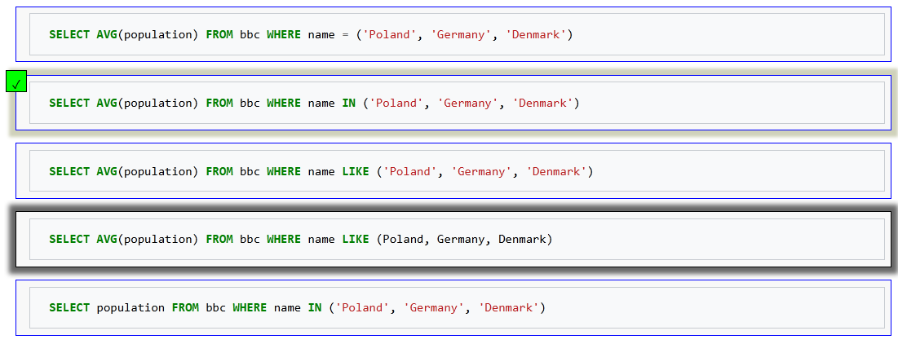
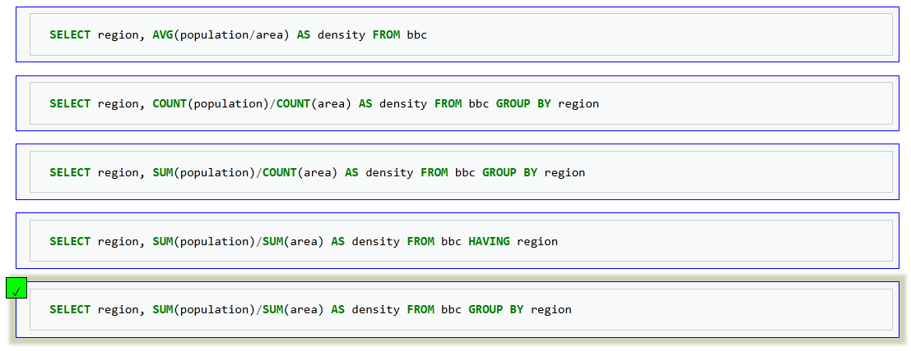
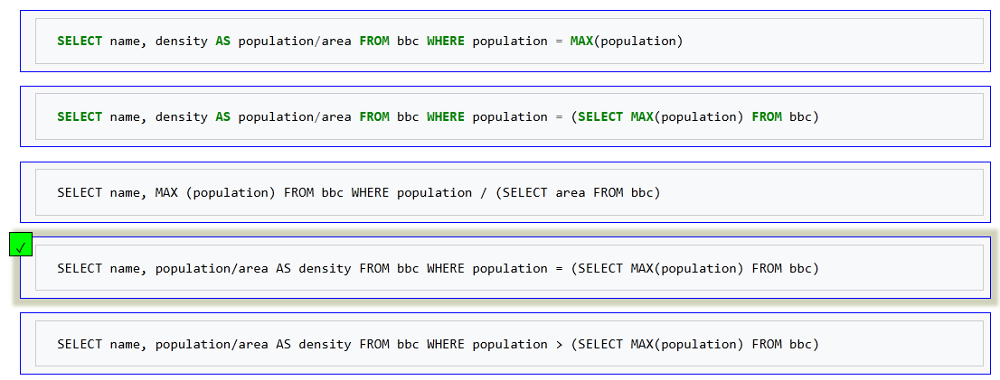
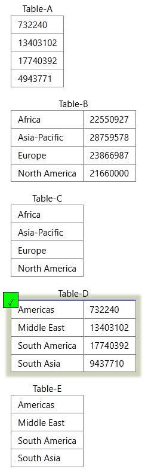

<!-- omit in toc -->
# Tutorials: Learn SQL step by step

This file contains the solutions to the quiz's questions posed by <https://sqlzoo.net/wiki/Tutorial_Quizzes>.


<!-- omit in toc -->
## Table of Contents

- [1. SELECT Quiz](#1-select-quiz)
- [2. BBC Quiz](#2-bbc-quiz)
- [3. Nobel Quiz](#3-nobel-quiz)
- [4. Nested SELECT Quiz](#4-nested-select-quiz)
- [5. SUM and COUNT Quiz](#5-sum-and-count-quiz)
- [6. JOIN Quiz](#6-join-quiz)
- [7. JOIN Quiz 2](#7-join-quiz-2)
- [8. Using Null Quiz](#8-using-null-quiz)
- [9. Self JOIN Quiz](#9-self-join-quiz)


## 1. SELECT Quiz

Webpage <https://sqlzoo.net/wiki/SELECT_Quiz>.


<!-- omit in toc -->
### 1.


---


<!-- omit in toc -->
### 2.


---


<!-- omit in toc -->
### 3.


---


<!-- omit in toc -->
### 4.


---


<!-- omit in toc -->
### 5.


---


<!-- omit in toc -->
### 6.


---


<!-- omit in toc -->
### 7.


<div align="right">

  [](#table-of-contents)
</div>

---


## 2. BBC Quiz

Webpage: <https://sqlzoo.net/wiki/BBC_QUIZ>.


<!-- omit in toc -->
### 1.


---


<!-- omit in toc -->
### 2.


---


<!-- omit in toc -->
### 3.


---


<!-- omit in toc -->
### 4.


---


<!-- omit in toc -->
### 5.


---


<!-- omit in toc -->
### 6.


---


<!-- omit in toc -->
### 7.


<div align="right">

  [](#table-of-contents)
</div>

---


## 3. Nobel Quiz

Webpage: <https://sqlzoo.net/wiki/Nobel_Quiz>.


<!-- omit in toc -->
### 1.


---


<!-- omit in toc -->
### 2.


---


<!-- omit in toc -->
### 3.


---


<!-- omit in toc -->
### 4.


---


<!-- omit in toc -->
### 5.


---


<!-- omit in toc -->
### 6.


---


<!-- omit in toc -->
### 7.


<div align="right">

  [](#table-of-contents)
</div>

---


## 4. Nested SELECT Quiz

Webpage: <https://sqlzoo.net/wiki/Nested_SELECT_Quiz>.


<!-- omit in toc -->
### 1.


---


<!-- omit in toc -->
### 2.


---


<!-- omit in toc -->
### 3.


---


<!-- omit in toc -->
### 4.


---


<!-- omit in toc -->
### 5.


---


<!-- omit in toc -->
### 6.


---


<!-- omit in toc -->
### 7.


<div align="right">

  [](#table-of-contents)
</div>

---


## 5. SUM and COUNT Quiz

Webpage: <https://sqlzoo.net/wiki/SUM_and_COUNT_Quiz>.


<!-- omit in toc -->
### 1. Select the statement that shows the sum of population of all countries in 'Europe'



---


<!-- omit in toc -->
### 2. Select the statement that shows the number of countries with population smaller than 150000



---


<!-- omit in toc -->
### 3. Select the list of core SQL aggregate functions



---


<!-- omit in toc -->
### 4. Select the result that would be obtained from the following code

```SQL
 SELECT region, SUM(area)
   FROM bbc
  WHERE SUM(area) > 15000000
  GROUP BY region
```



---


<!-- omit in toc -->
### 5. Select the statement that shows the average population of 'Poland', 'Germany' and 'Denmark'



---


<!-- omit in toc -->
### 6. Select the statement that shows the medium population density of each region



---


<!-- omit in toc -->
### 7. Select the statement that shows the name and population density of the country with the largest population



---


<!-- omit in toc -->
### 8. Pick the result that would be obtained from the following code

```SQL
 SELECT region, SUM(area) 
   FROM bbc 
  GROUP BY region
 HAVING SUM(area) <= 20000000
```




<div align="right">

  [](#table-of-contents)
</div>

---


## 6. JOIN Quiz

Webpage: <https://sqlzoo.net/wiki/JOIN_Quiz>.


<!-- omit in toc -->
### 1.


---


<!-- omit in toc -->
### 2.


---


<!-- omit in toc -->
### 3.


---


<!-- omit in toc -->
### 4.


---


<!-- omit in toc -->
### 5.


---


<!-- omit in toc -->
### 6.


---


<!-- omit in toc -->
### 7.


<div align="right">

  [](#table-of-contents)
</div>

---


## 7. JOIN Quiz 2

Webpage: <https://sqlzoo.net/wiki/JOIN_Quiz_2>.


<!-- omit in toc -->
### 1.


---


<!-- omit in toc -->
### 2.


---


<!-- omit in toc -->
### 3.


---


<!-- omit in toc -->
### 4.


---


<!-- omit in toc -->
### 5.


---


<!-- omit in toc -->
### 6.


---


<!-- omit in toc -->
### 7.


<div align="right">

  [](#table-of-contents)
</div>

---


## 8. Using Null Quiz

Webpage: <https://sqlzoo.net/wiki/Using_Null_Quiz>.


<!-- omit in toc -->
### 1.


---


<!-- omit in toc -->
### 2.


---


<!-- omit in toc -->
### 3.


---


<!-- omit in toc -->
### 4.


---


<!-- omit in toc -->
### 5.


---


<!-- omit in toc -->
### 6.


<div align="right">

  [](#table-of-contents)
</div>

---


## 9. Self JOIN Quiz

Webpage: <https://sqlzoo.net/wiki/Self_join_Quiz>.


<!-- omit in toc -->
### 1.


---


<!-- omit in toc -->
### 2.


---


<!-- omit in toc -->
### 3.


<div align="right">

  [](#table-of-contents)
</div>
