<!-- omit in toc -->
# Tutorials: Learn SQL step by step

This file contains the solutions to the quiz's questions posed by <https://sqlzoo.net/wiki/Tutorial_Quizzes>.


<!-- omit in toc -->
## Table of Contents

- [1. SELECT Quiz (last edited 01/08/2025)](#1-select-quiz-last-edited-01082025)
- [2. BBC Quiz](#2-bbc-quiz)
- [3. Nobel Quiz](#3-nobel-quiz)
- [4. Nested SELECT Quiz](#4-nested-select-quiz)
- [5. SUM and COUNT Quiz (last edited 22/07/2025)](#5-sum-and-count-quiz-last-edited-22072025)
- [6. JOIN Quiz (last edited 27/07/2025)](#6-join-quiz-last-edited-27072025)
- [7. JOIN Quiz 2 (last edited 29/07/2025)](#7-join-quiz-2-last-edited-29072025)
- [8. Using Null Quiz (last edited 30/07/2025)](#8-using-null-quiz-last-edited-30072025)
- [9. Self JOIN Quiz (last edited 05/08/2025)](#9-self-join-quiz-last-edited-05082025)


## 1. SELECT Quiz (last edited 01/08/2025)

Webpage <https://sqlzoo.net/wiki/SELECT_Quiz>.


<!-- omit in toc -->
### 1. Select the code which produces this table

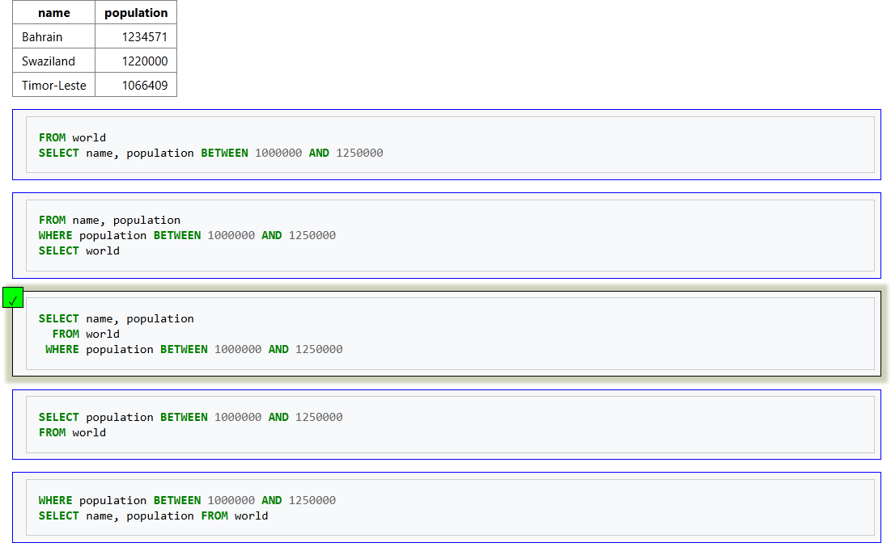

---


<!-- omit in toc -->
### 2. Pick the result you would obtain from this code

```SQL
SELECT name, population
FROM world
WHERE name LIKE "Al%"
```

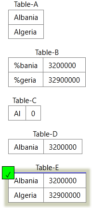

---


<!-- omit in toc -->
### 3. Select the code which shows the countries that end in A or L

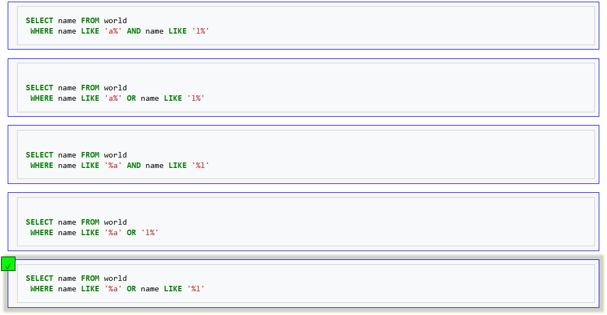

---


<!-- omit in toc -->
### 4. Pick the result from the query

```SQL
SELECT name,length(name)
FROM world
WHERE length(name)=5 and region='Europe'
```

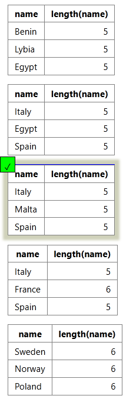

---


<!-- omit in toc -->
### 5. Here are the first few rows of the world table

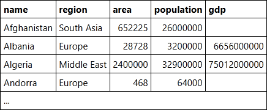

```SQL
SELECT name, area*2 FROM world WHERE population = 64000
```

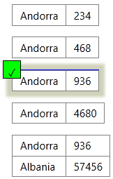

---


<!-- omit in toc -->
### 6. Select the code that would show the countries with an area larger than 50000 and a population smaller than 10000000

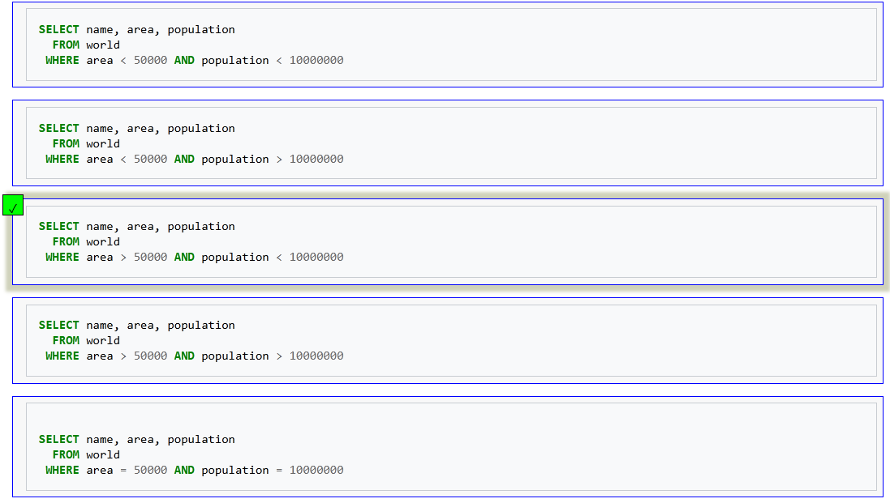

---


<!-- omit in toc -->
### 7. Select the code that shows the population density of China, Australia, Nigeria and France

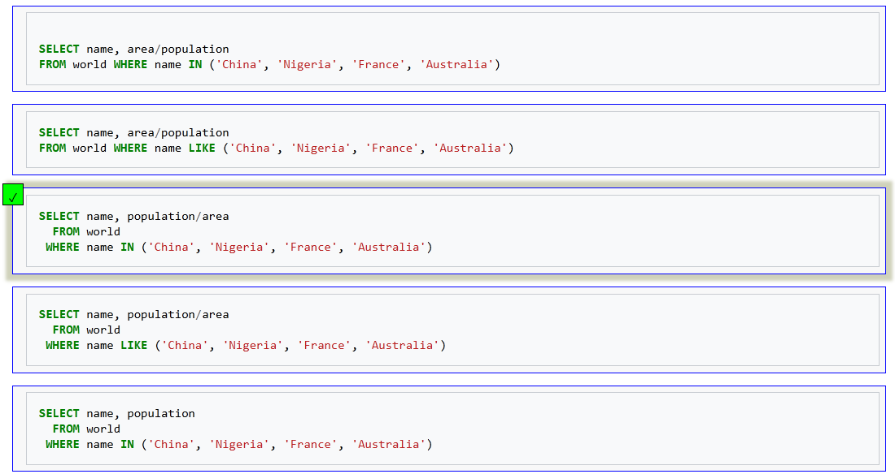


<div align="right">

  [](#table-of-contents)
</div>

---


## 2. BBC Quiz

Webpage: <https://sqlzoo.net/wiki/BBC_QUIZ>.


<!-- omit in toc -->
### 1.


---


<!-- omit in toc -->
### 2.


---


<!-- omit in toc -->
### 3.


---


<!-- omit in toc -->
### 4.


---


<!-- omit in toc -->
### 5.


---


<!-- omit in toc -->
### 6.


---


<!-- omit in toc -->
### 7.


<div align="right">

  [](#table-of-contents)
</div>

---


## 3. Nobel Quiz

Webpage: <https://sqlzoo.net/wiki/Nobel_Quiz>.


<!-- omit in toc -->
### 1.


---


<!-- omit in toc -->
### 2.


---


<!-- omit in toc -->
### 3.


---


<!-- omit in toc -->
### 4.


---


<!-- omit in toc -->
### 5.


---


<!-- omit in toc -->
### 6.


---


<!-- omit in toc -->
### 7.


<div align="right">

  [](#table-of-contents)
</div>

---


## 4. Nested SELECT Quiz

Webpage: <https://sqlzoo.net/wiki/Nested_SELECT_Quiz>.


<!-- omit in toc -->
### 1.


---


<!-- omit in toc -->
### 2.


---


<!-- omit in toc -->
### 3.


---


<!-- omit in toc -->
### 4.


---


<!-- omit in toc -->
### 5.


---


<!-- omit in toc -->
### 6.


---


<!-- omit in toc -->
### 7.


<div align="right">

  [](#table-of-contents)
</div>

---


## 5. SUM and COUNT Quiz (last edited 22/07/2025)

Webpage: <https://sqlzoo.net/wiki/SUM_and_COUNT_Quiz>.


<!-- omit in toc -->
### 1. Select the statement that shows the sum of population of all countries in 'Europe'

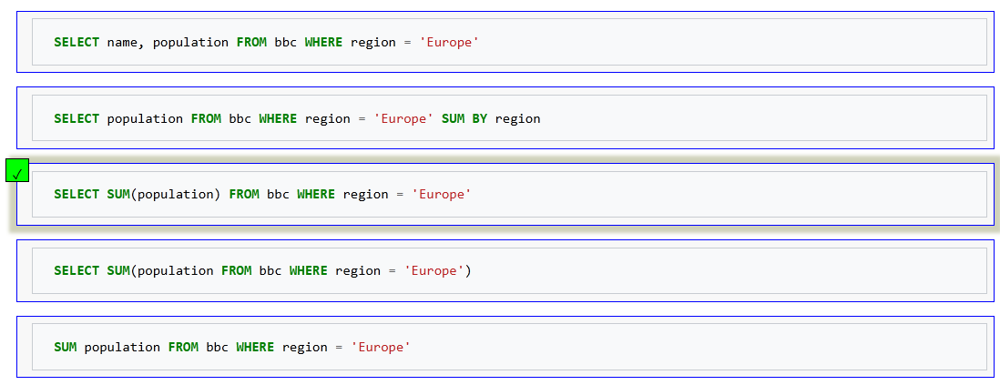

---


<!-- omit in toc -->
### 2. Select the statement that shows the number of countries with population smaller than 150000


---


<!-- omit in toc -->
### 3. Select the list of core SQL aggregate functions


---


<!-- omit in toc -->
### 4. Select the result that would be obtained from the following code

```SQL
 SELECT region, SUM(area)
   FROM bbc
  WHERE SUM(area) > 15000000
  GROUP BY region
```


---


<!-- omit in toc -->
### 5. Select the statement that shows the average population of 'Poland', 'Germany' and 'Denmark'

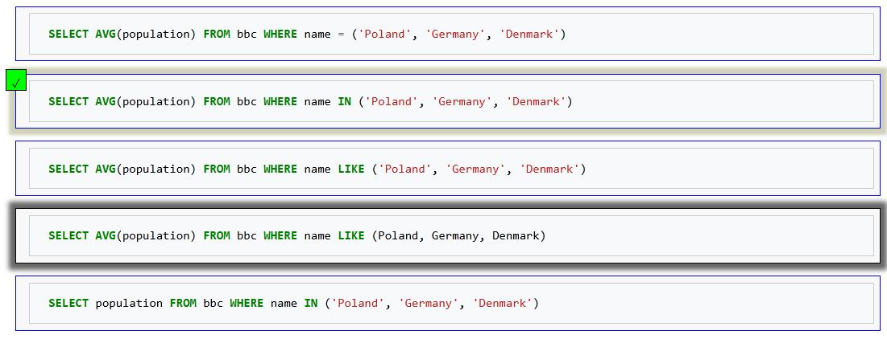

---


<!-- omit in toc -->
### 6. Select the statement that shows the medium population density of each region

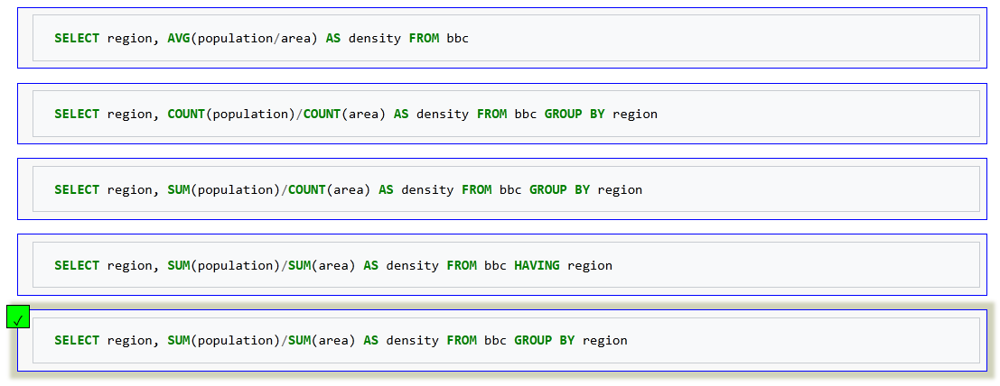

---


<!-- omit in toc -->
### 7. Select the statement that shows the name and population density of the country with the largest population

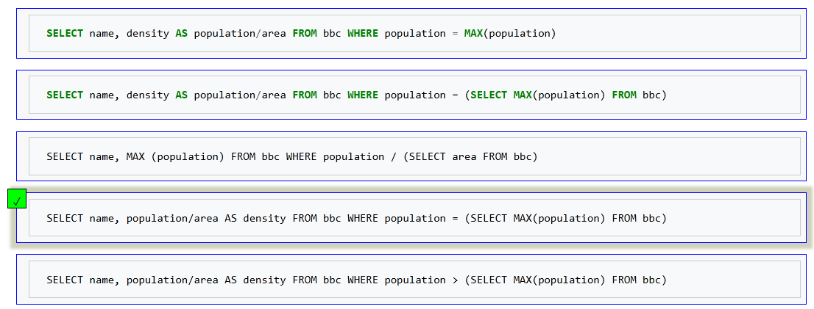

---


<!-- omit in toc -->
### 8. Pick the result that would be obtained from the following code

```SQL
 SELECT region, SUM(area)
   FROM bbc 
  GROUP BY region
 HAVING SUM(area) <= 20000000
```

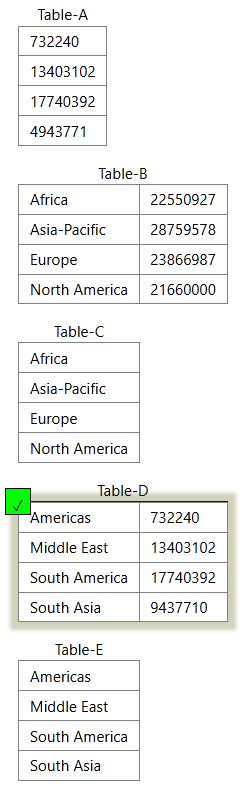


<div align="right">

  [](#table-of-contents)
</div>

---


## 6. JOIN Quiz (last edited 27/07/2025)

Webpage: <https://sqlzoo.net/wiki/JOIN_Quiz>.


<!-- omit in toc -->
### 1. You want to find the stadium where player 'Dimitris Salpingidis' scored. Select the JOIN condition to use

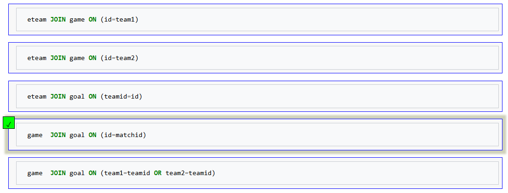

---


<!-- omit in toc -->
### 2. You JOIN the tables _goal_ and _eteam_ in an SQL statement. Indicate the list of column names that may be used in the SELECT line

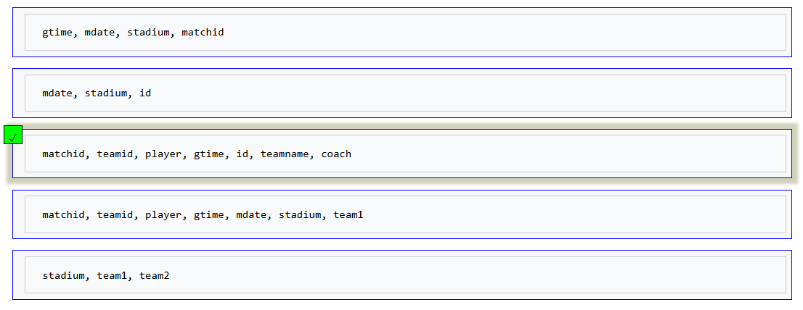

---


<!-- omit in toc -->
### 3. Select the code which shows players, their team and the amount of goals they scored against Greece(GRE)

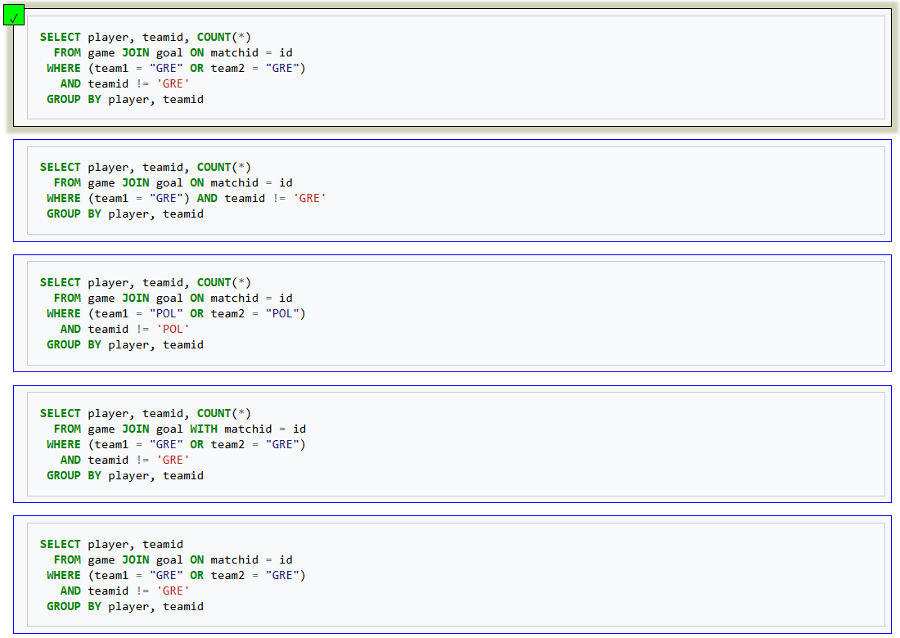

---


<!-- omit in toc -->
### 4. Select the result that would be obtained from this code

```SQL
SELECT DISTINCT teamid, mdate
  FROM goal JOIN game on (matchid=id)
 WHERE mdate = '9 June 2012'
```

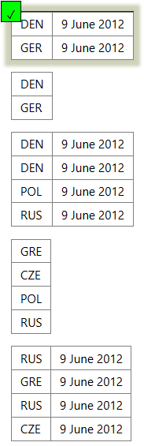

---


<!-- omit in toc -->
### 5. Select the code which would show the player and their team for those who have scored against Poland(POL) in National Stadium, Warsaw

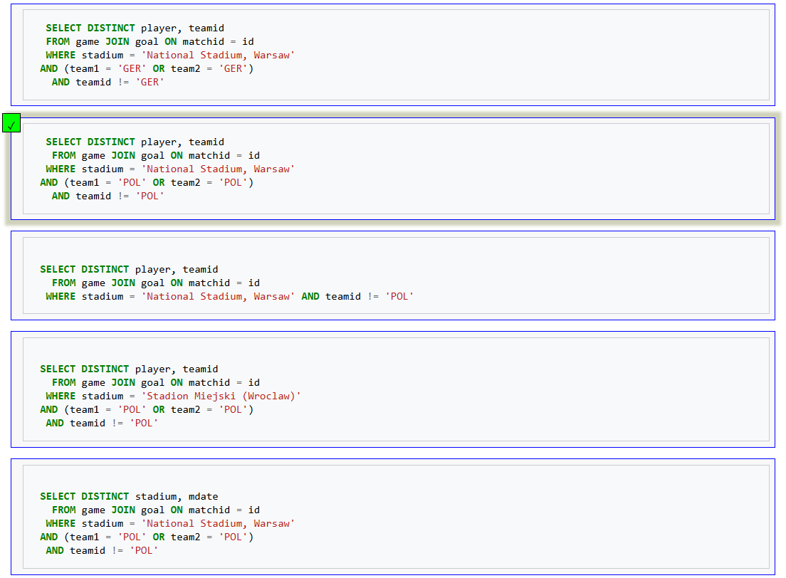

---


<!-- omit in toc -->
### 6. Select the code which shows the player, their team and the time they scored, for players who have played in Stadion Miejski (Wroclaw) but not against Italy(ITA)

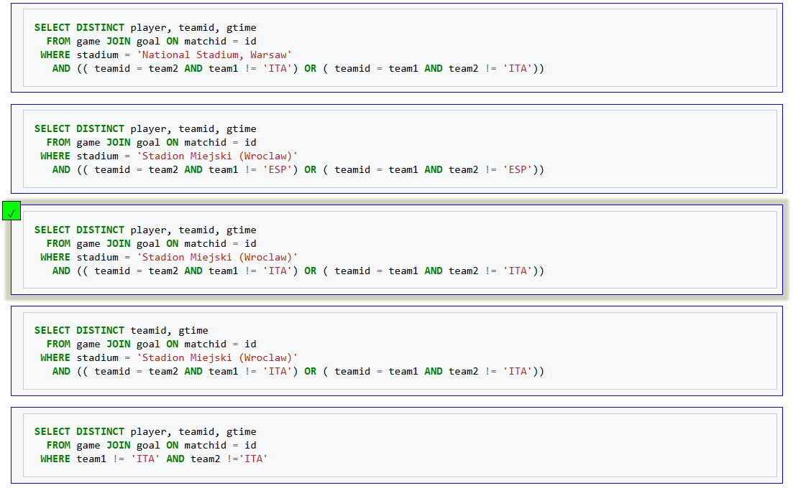

---


<!-- omit in toc -->
### 7. Select the result that would be obtained from this code

```SQL
SELECT teamname, COUNT(*)
  FROM eteam JOIN goal ON teamid = id
 GROUP BY teamname
HAVING COUNT(*) < 3
```

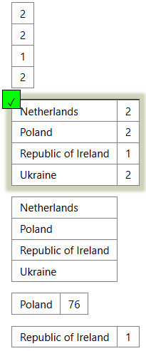


<div align="right">

  [](#table-of-contents)
</div>

---


## 7. JOIN Quiz 2 (last edited 29/07/2025)

Webpage: <https://sqlzoo.net/wiki/JOIN_Quiz_2>.


<!-- omit in toc -->
### 1. Select the statement which lists the unfortunate directors of the movies which have caused financial loses (gross < budget)

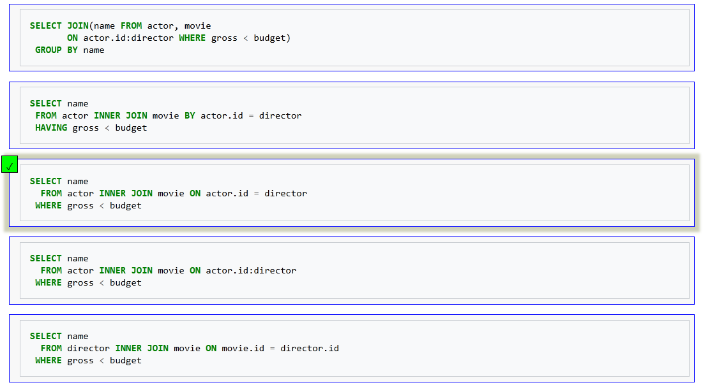

---


<!-- omit in toc -->
### 2. Select the correct example of JOINing three tables

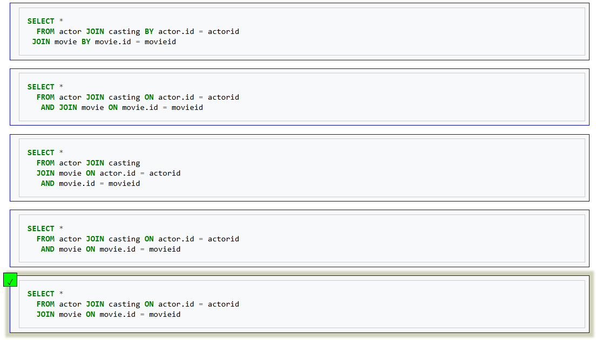

---


<!-- omit in toc -->
### 3. Select the statement that shows the list of actors called 'John' by order of number of movies in which they acted

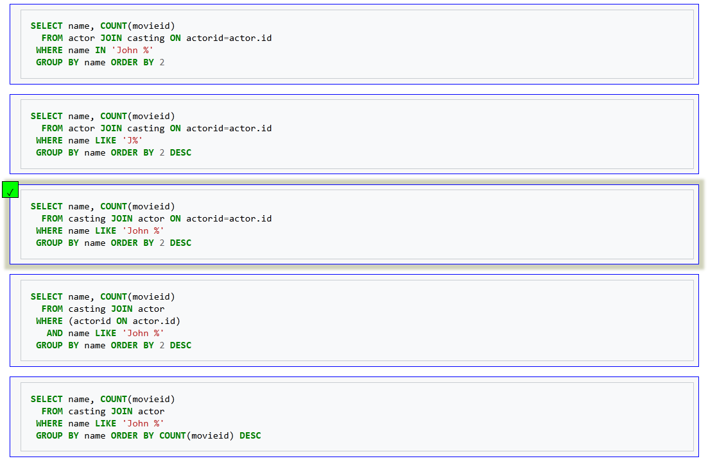

---


<!-- omit in toc -->
### 4. Select the result that would be obtained from the following code

```SQL
SELECT title
  FROM movie JOIN casting ON (movieid = movie.id)
             JOIN actor   ON (actorid = actor.id)
 WHERE name = 'Paul Hogan'
   AND ord = 1
```

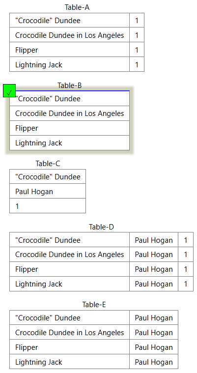

---


<!-- omit in toc -->
### 5. Select the statement that lists all the actors that starred in movies directed by Ridley Scott who has id 351

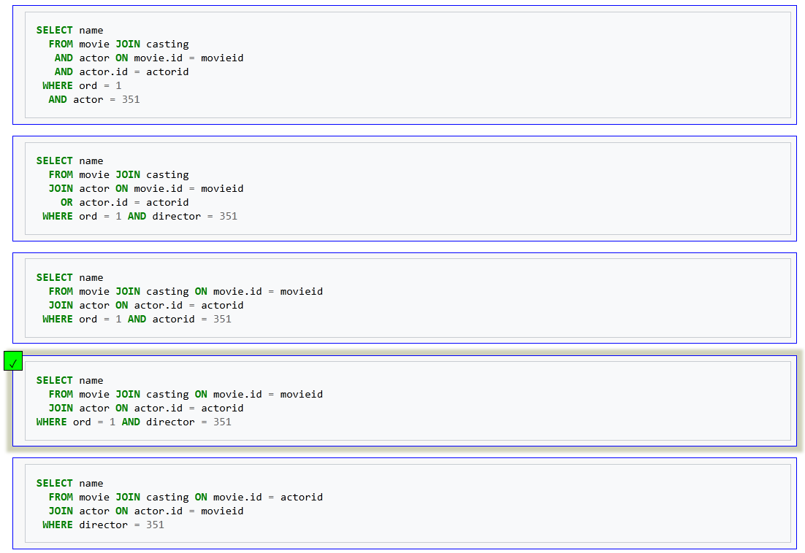

---


<!-- omit in toc -->
### 6. There are two sensible ways to connect movie and actor. They are

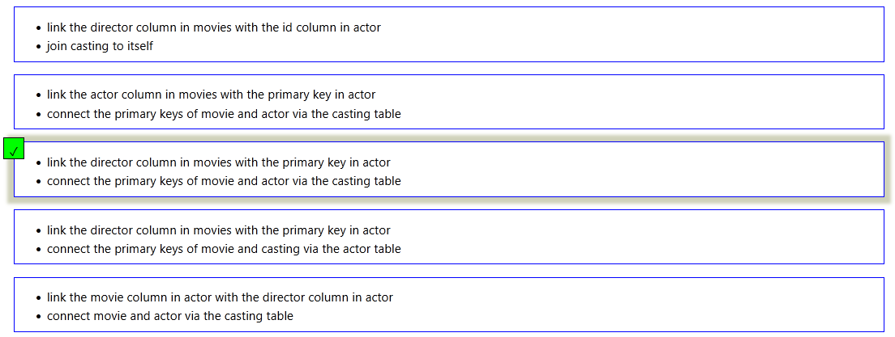

---


<!-- omit in toc -->
### 7. Select the result that would be obtained from the following code

```SQL
SELECT title, yr
  FROM movie, casting, actor
 WHERE name = 'Robert De Niro'
   AND movieid = movie.id
   AND actorid = actor.id
   AND ord = 3
```

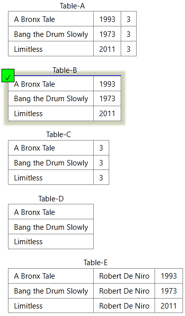


<div align="right">

  [](#table-of-contents)
</div>

---


## 8. Using Null Quiz (last edited 30/07/2025)

Webpage: <https://sqlzoo.net/wiki/Using_Null_Quiz>.


<!-- omit in toc -->
### 1. Select the code which uses an outer join correctly

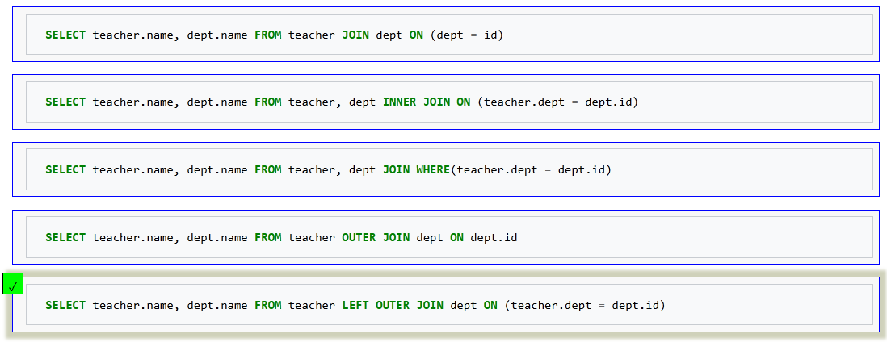

---


<!-- omit in toc -->
### 2. Select the correct statement that shows the name of department which employs Cutflower -

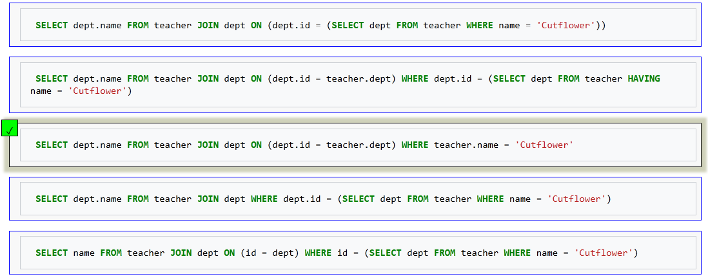

---


<!-- omit in toc -->
### 3. Select out of following the code which uses a JOIN to show a list of all the departments and number of employed teachers

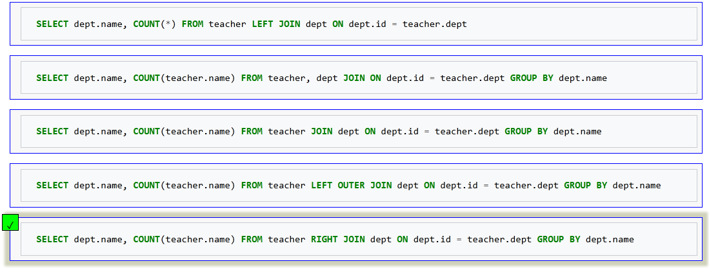

---


<!-- omit in toc -->
### 4. Using `SELECT name, dept, COALESCE(dept, 0) AS result FROM teacher` on `teacher` table will

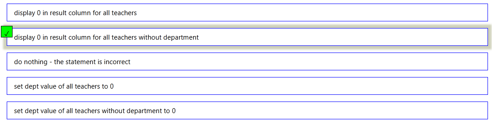

---


<!-- omit in toc -->
### 5. Query

```SQL
SELECT name,
       CASE WHEN phone = 2752 THEN 'two'
            WHEN phone = 2753 THEN 'three'
            WHEN phone = 2754 THEN 'four'
            END AS digit
  FROM teacher
```

shows following 'digit'

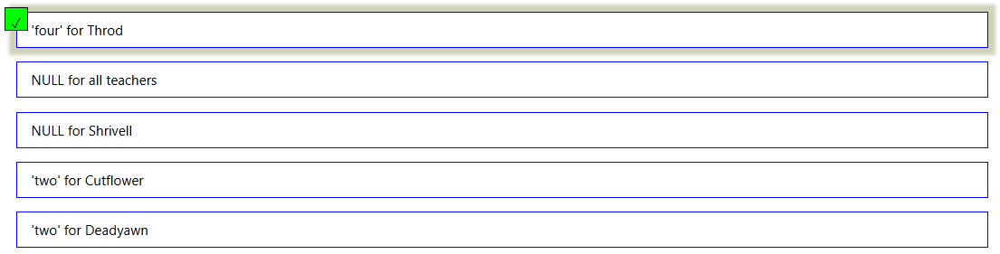

---


<!-- omit in toc -->
### 6. Select the result that would be obtained from the following code

```SQL
SELECT name,
     CASE
       WHEN dept
       IN (1)
       THEN 'Computing'
       ELSE 'Other'
     END
 FROM teacher
```

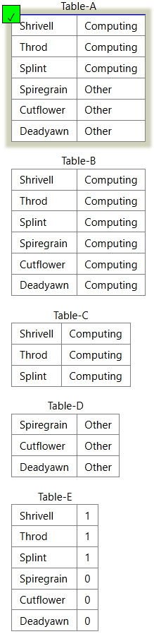


<div align="right">

  [](#table-of-contents)
</div>

---


## 9. Self JOIN Quiz (last edited 05/08/2025)

Webpage: <https://sqlzoo.net/wiki/Self_join_Quiz>.


<!-- omit in toc -->
### 1. Select the code that would show it is possible to get from Craiglockhart to Haymarket

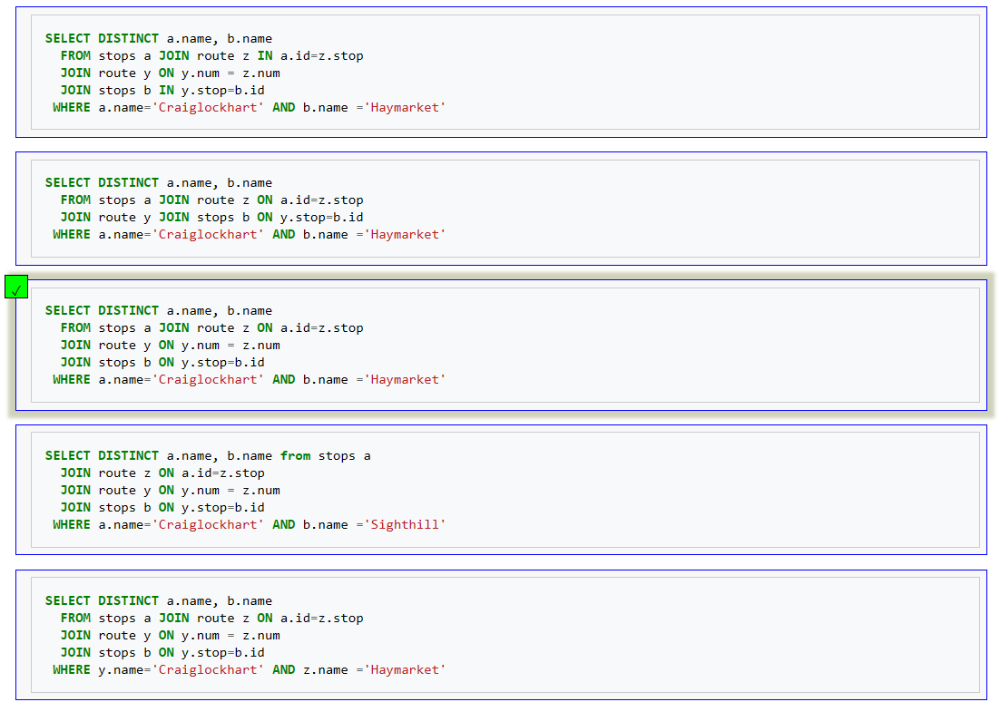

---


<!-- omit in toc -->
### 2. Select the code that shows the stops that are on route.num '2A' which can be reached with one bus from Haymarket

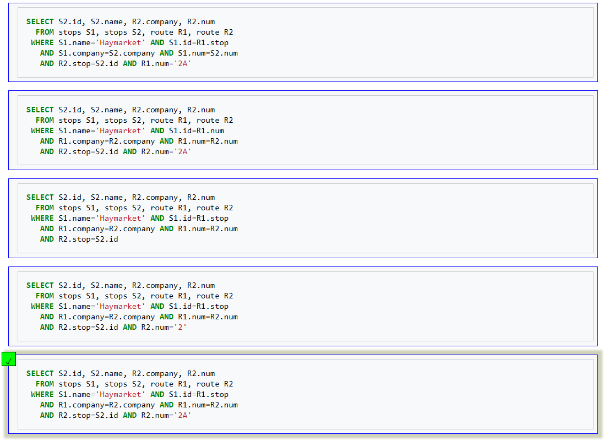

---


<!-- omit in toc -->
### 3. Select the code that shows the services available from Tollcross

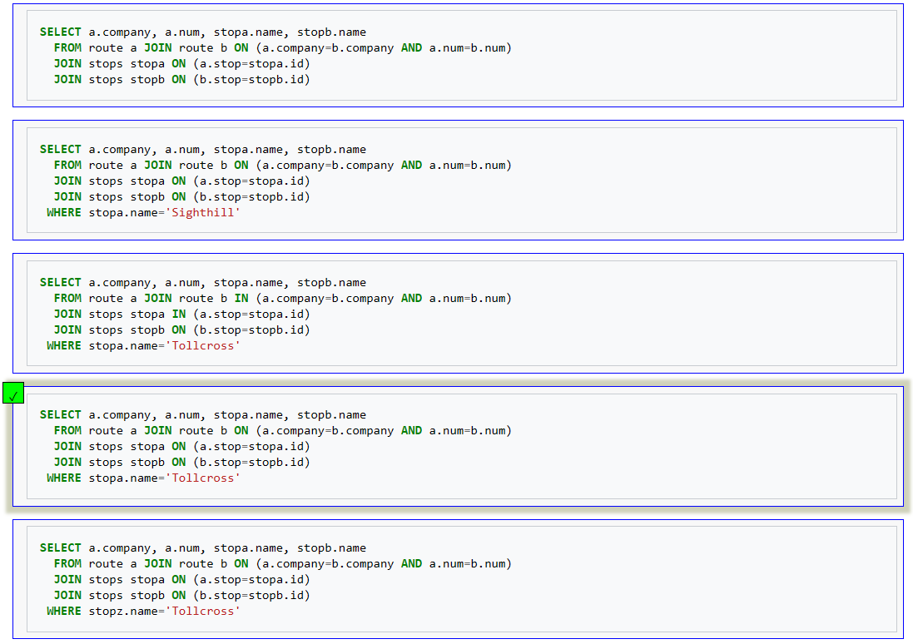


<div align="right">

  [](#table-of-contents)
</div>
