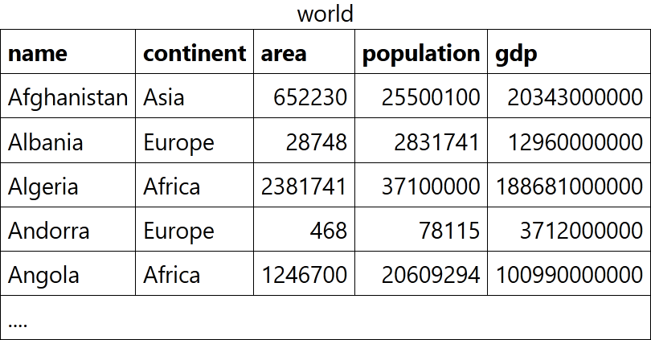
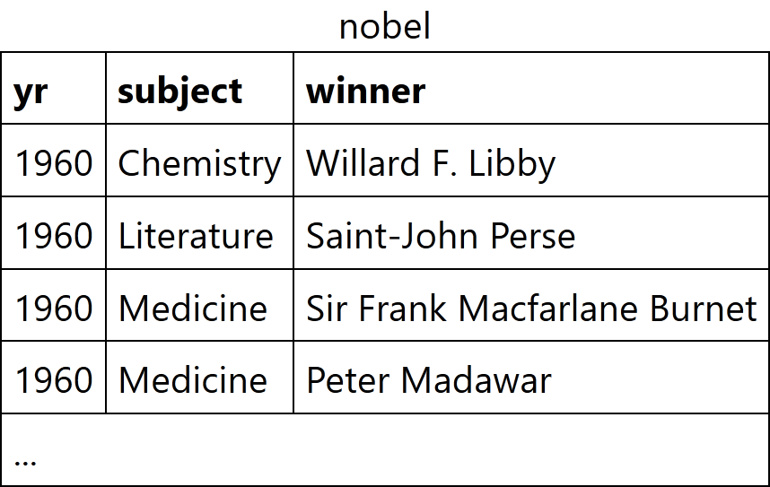

<!-- omit in toc -->
# Tutorials: Learn SQL step by step

This file contains the solutions (SQL queries) to the tutorial's questions posed by <https://sqlzoo.net/wiki/SQL_Tutorial>.


<!-- omit in toc -->
## Table of Contents

- [0 SELECT basics (last edited 20/07/2025)](#0-select-basics-last-edited-20072025)
- [1 SELECT name (last edited 21/07/2025)](#1-select-name-last-edited-21072025)
- [2 SELECT from WORLD Tutorial (last edited 20/07/2025)](#2-select-from-world-tutorial-last-edited-20072025)
- [3 SELECT from Nobel (last edited 20/07/2025)](#3-select-from-nobel-last-edited-20072025)
- [4 SELECT within SELECT Tutorial (last edited 20/07/2025)](#4-select-within-select-tutorial-last-edited-20072025)
- [5 SUM and COUNT (last edited 22/07/2025)](#5-sum-and-count-last-edited-22072025)
- [\*The nobel table can be used to practice more SUM and COUNT functions](#the-nobel-table-can-be-used-to-practice-more-sum-and-count-functions)
- [6 The JOIN operation](#6-the-join-operation)
- [\*Old JOIN Tutorial](#old-join-tutorial)
- [\*Music Tutorial](#music-tutorial)
- [7 More JOIN operations](#7-more-join-operations)
- [8 Using Null](#8-using-null)
- [\*Scottish Parliament](#scottish-parliament)
- [8+ NSS Tutorial (Numeric Examples)](#8-nss-tutorial-numeric-examples)
- [9- Window functions](#9--window-functions)
- [9+ Window LAG (COVID 19)](#9-window-lag-covid-19)
- [9 Self Join](#9-self-join)


## 0 SELECT basics (last edited 20/07/2025)

Introducing the world table of countries

<div id="header" align="center">

  

</div>


<!-- omit in toc -->
### 1. The example uses a WHERE clause to show the population of 'France'. Note that strings should be in 'single quotes'; _Modify it to show the population of Germany_

```SQL
SELECT population
  FROM world
 WHERE name = 'Germany'

```

---


<!-- omit in toc -->
### 2. Checking a list The word _IN_ allows us to check if an item is in a list. The example shows the name and population for the countries 'Brazil', 'Russia', 'India' and 'China'. _Show the name and the population for 'Sweden', 'Norway' and 'Denmark'_

```SQL
SELECT name, population
  FROM world
 WHERE name IN ('Sweden', 'Norway', 'Denmark')
```

---


<!-- omit in toc -->
### 3. Which countries are not too small and not too big? `BETWEEN` allows range checking (range specified is inclusive of boundary values). The example below shows countries with an area of 250,000-300,000 sq. km. Modify it to show the country and the area for countries with an area between 200,000 and 250,000

```SQL
SELECT name, area
  FROM world
 WHERE area BETWEEN 200000 AND 250000
```


<br />

> [!NOTE]
> <div align="center">
>
> [_***Accompanying SELECT Quiz***_](./Quizes.md#1-select-quiz)
>
> </div>


<div align="right">

  [](#table-of-contents)
</div>

---


## 1 SELECT name (last edited 21/07/2025)


<!-- omit in toc -->
### 1. You can use WHERE name LIKE 'B%' to find the countries that start with "B"

- The % is a wild-card it can match any characters

**Find the country that start with Y**


```SQL
SELECT name
  FROM world
 WHERE name LIKE 'Y%'
```

---


<!-- omit in toc -->
### 2. _Find the countries that end with y_

```SQL
SELECT name
  FROM world
 WHERE name LIKE '%y'
```

---


<!-- omit in toc -->
### 3. Luxembourg has an _x_ - so does one other country. List them both. _Find the countries that contain the letter x_

```SQL
SELECT name
  FROM world
 WHERE name LIKE '%x%'
```

---


<!-- omit in toc -->
### 4. Iceland, Switzerland end with _land_ - but are there others? _Find the countries that end with land_

```SQL
SELECT name
  FROM world
 WHERE name LIKE '%land'
```

---


<!-- omit in toc -->
### 5. Columbia starts with a _C_ and ends with _ia_ - there are two more like this. _Find the countries that start with C and end with ia_

```SQL
SELECT name
  FROM world
 WHERE name LIKE 'C%ia'
```

---


<!-- omit in toc -->
### 6. Greece has a double _e_ - who has a double _o_? _Find the country that has oo in the name_

```SQL
SELECT name
  FROM world
 WHERE name LIKE '%oo%'
```

---


<!-- omit in toc -->
### 7. Bahamas has three _a_ - who else? _Find the countries that have three or more a in the name_

```SQL
SELECT name
  FROM world
 WHERE name LIKE '%a%a%a%'
```

---


<!-- omit in toc -->
### 8. India and Angola have an _n_ as the second character. You can use the underscore as a single character wildcard. _Find the countries that have "t" as the second character_

```SQL
SELECT name
  FROM world
 WHERE name LIKE '_t%'
```

---


<!-- omit in toc -->
### 9. Lesotho and Moldova both have two o characters separated by two other characters. _Find the countries that have two "o" characters separated by two others._

```SQL
SELECT name
  FROM world
 WHERE name LIKE '%o__o%'
```

> [!NOTE]
> This query matches *characters* and not *letters* because "_" can be a whitespace (or any other character).


---


<!-- omit in toc -->
### 10. uba and Togo have four characters names. _Find the countries that have exactly four characters_

```SQL
SELECT name
  FROM world
 WHERE name LIKE '____'
```

---


<!-- omit in toc -->
### 11. The capital of _Luxembourg_ is _Luxembourg_. Show all the countries where the capital is the same as the name of the country. _Find the country where the name is the capital city_

```SQL
SELECT name
  FROM world
 WHERE name = capital
```

---


<!-- omit in toc -->
### 12. The capital of _Mexico_ is _Mexico City_. Show all the countries where the capital has the country together with the word "City". _Find the country where the capital is the country plus "City"_

```SQL
SELECT name
  FROM world
 WHERE capital = CONCAT(name, ' City')
```

---


<!-- omit in toc -->
### 13. _Find the capital and the name where the capital includes the name of the country_

```SQL
SELECT capital, name
  FROM world
 WHERE capital LIKE CONCAT('%', name, '%')
```

---


<!-- omit in toc -->
### 14. _Find the capital and the name where the capital is an extension of name of the country._ You should include _Mexico City_ as it is longer than _Mexico_. You should not include _Luxembourg_ as the capital is the same as the country

```SQL
SELECT capital, name
  FROM world
 WHERE capital LIKE CONCAT('%', name, '%')
   AND capital != name
```

---


<!-- omit in toc -->
### 15. The capital of _Monaco_ is _Monaco-Ville_: this is the name _Monaco_ and the extension is _-Ville_. _Show the name and the extension where the capital is a proper (non-empty) extension of name of the country_

```SQL
SELECT name, REPLACE(capital, name, '') AS extension
  FROM world
 WHERE capital LIKE CONCAT('%', name, '%')
   AND capital != name
```

<div align="right">

  [](#table-of-contents)
</div>

---


## 2 SELECT from WORLD Tutorial (last edited 20/07/2025)


<!-- omit in toc -->
### 1. [Read the notes about this table](https://sqlzoo.net/wiki/Read_the_notes_about_this_table.). Observe the result of running this SQL command to show the name, continent and population of all countries

```SQL
SELECT name, continent, population
  FROM world
```

---


<!-- omit in toc -->
### 2. [How to use WHERE to filter records](https://sqlzoo.net/wiki/WHERE_filters). Show the name for the countries that have a population of at least 200 million. 200 million is 200000000, there are eight zeros

```SQL
SELECT name
  FROM world
 WHERE population > 200000000
```

---


<!-- omit in toc -->
### 3. Give the `name` and the _per capita GDP_ for those countries with a `population` of at least 200 million

```SQL
SELECT name, gdp/population
  FROM world
 WHERE population > 200000000
```

---


<!-- omit in toc -->
### 4. Show the `name` and `population` in millions for the countries of the `continent` 'South America'. Divide the population by 1000000 to get population in millions

```SQL
SELECT name, population/1000000
  FROM world
 WHERE continent LIKE 'South America'
```

---


<!-- omit in toc -->
### 5. Show the `name` and `population` for France, Germany, Italy

```SQL
SELECT name, population
  FROM world
 WHERE name IN ('France', 'Germany', 'Italy')
```

---


<!-- omit in toc -->
### 6. Show the countries which have a `name` that includes the word 'United'

```SQL
SELECT name
  FROM world
 WHERE name LIKE '%United%'
```

---


<!-- omit in toc -->
### 7. Two ways to be big: A country is _big_ if it has an area of more than 3 million sq km or it has a population of more than 250 million. _Show the countries that are big by area or big by population. Show name, population and area_

```SQL
SELECT name, population, area
  FROM world
 WHERE (population > 250000000) OR (area > 3000000)
```

---


<!-- omit in toc -->
### 8. Exclusive OR (XOR). Show the countries that are big by area (more than 3 million) or big by population (more than 250 million) but not both. Show name, population and area

- Australia has a big area but a small population, it should be included.
- Indonesia has a big population but a small area, it should be included.
- China has a big population and big area, it should be excluded.
- United Kingdom has a small population and a small area, it should be excluded.

```SQL
SELECT name, population, area
  FROM world
 WHERE (population > 250000000) XOR (area > 3000000)
```

---


<!-- omit in toc -->
### 9. Show the `name` and `population` in millions and the GDP in billions for the countries of the `continent` 'South America'. Use the [ROUND](https://sqlzoo.net/wiki/ROUND) function to show the values to two decimal places. _For Americas show population in millions and GDP in billions both to 2 decimal places_

```SQL
SELECT name, ROUND(population/1000000, 2), ROUND(gdp/1000000000, 2)
  FROM world
 WHERE continent = 'South America'
```

---


<!-- omit in toc -->
### 10. Show the `name` and per-capita GDP for those countries with a GDP of at least one trillion (1000000000000; that is 12 zeros). Round this value to the nearest 1000. _Show per-capita GDP for the trillion dollar countries to the nearest $1000_

```SQL
SELECT name, ROUND(gdp/population, -3)
  FROM world
 WHERE gdp > 1000000000000
```

---


<!-- omit in toc -->
### 11. Greece has capital Athens. Each of the strings 'Greece', and 'Athens' has 6 characters. _Show the name and capital where the name and the capital have the same number of characters._

- You can use the LENGTH function to find the number of characters in a string
  - For Microsoft SQL Server the function LENGTH is LEN

```SQL
SELECT name, capital
  FROM world
 WHERE LENGTH(name) = LENGTH(capital)
```

---


<!-- omit in toc -->
### 12. The capital of Sweden is Stockholm. Both words start with the letter 'S'. _Show the name and the capital where the first letters of each match. Don't include countries where the name and the capital are the same word_

- You can use the function LEFT to isolate the first character.
- You can use <> as the NOT EQUALS operator.

```SQL
SELECT name, capital
  FROM world
 WHERE LEFT(name, 1) = LEFT(capital, 1)
   AND name <> capital
```

---


<!-- omit in toc -->
### 13. _Equatorial Guinea_ and _Dominican Republic_ have all of the vowels (a e i o u) in the name. They don't count because they have more than one word in the name. _Find the country that has all the vowels and no spaces in its name_

- You can use the phrase name `NOT LIKE '%a%'` to exclude characters from your results.
- The query shown misses countries like Bahamas and Belarus because they contain at least one 'a'

```SQL
SELECT name
  FROM world
 WHERE name LIKE '%a%'
   AND name LIKE '%e%'
   AND name LIKE '%i%'
   AND name LIKE '%o%'
   AND name LIKE '%u%'
   AND name NOT LIKE '% %'
```


<br />

> [!NOTE]
> <div align="center">
>
> [_***Accompanying BBC Quiz***_](./Quizes.md#2-bbc-quiz)
>
> </div>


<div align="right">

  [](#table-of-contents)
</div>

---


## 3 SELECT from Nobel (last edited 20/07/2025)





<!-- omit in toc -->
### 1. Change the query shown so that it displays Nobel prizes for 1950

```SQL
SELECT yr, subject, winner
  FROM nobel
 WHERE yr = 1950
```

---


<!-- omit in toc -->
### 2. Show who won the 1962 prize for literature

```SQL
SELECT winner
  FROM nobel
 WHERE yr = 1962
   AND subject = 'literature'
```

---


<!-- omit in toc -->
### 3. Show the year and subject that won 'Albert Einstein' his prize

```SQL
SELECT yr, subject
  FROM nobel
 WHERE winner = 'Albert Einstein'
```

---


<!-- omit in toc -->
### 4. Give the name of the 'peace' winners since the year 2000, including 2000

```SQL
SELECT winner
  FROM nobel
 WHERE yr >= 2000
   AND subject = 'peace'
```

---


<!-- omit in toc -->
### 5. Show all details (_yr_, _subject_, _winner_) of the literature prize winners for 1980 to 1989 inclusive

```SQL
SELECT yr, subject, winner
  FROM nobel
 WHERE yr BETWEEN 1980 AND 1989
   AND subject = 'literature'
```

---


<!-- omit in toc -->
### 6. Show all details of the presidential winners

- Theodore Roosevelt
- Thomas Woodrow Wilson
- Jimmy Carter
- Barack Obama

```SQL
SELECT yr, subject, winner
  FROM nobel
 WHERE winner = 'Theodore Roosevelt'
    OR winner = 'Thomas Woodrow Wilson'
    OR winner = 'Jimmy Carter'
    OR winner = 'Barack Obama'
```

---


<!-- omit in toc -->
### 7. Show the winners with first name John

```SQL
SELECT winner
  FROM nobel
 WHERE winner LIKE 'John %'
```

---


<!-- omit in toc -->
### 8. _Show the year, subject, and name of physics winners for 1980 together with the chemistry winners for 1984_

```SQL
SELECT yr, subject, winner
  FROM nobel
 WHERE (yr = 1980 AND subject = 'physics')
    OR (yr = 1984 AND subject = 'chemistry')
```

---


<!-- omit in toc -->
### 9. _Show the year, subject, and name of winners for 1980 excluding chemistry and medicine_

```SQL
SELECT yr, subject, winner
  FROM nobel
 WHERE yr = 1980
   AND subject NOT LIKE 'chemistry'
   AND subject NOT LIKE 'medicine'
```

---


<!-- omit in toc -->
### 10. Show year, subject, and name of people who won a 'Medicine' prize in an early year (before 1910, not including 1910) together with winners of a 'Literature' prize in a later year (after 2004, including 2004)

```SQL
SELECT yr, subject, winner
  FROM nobel
 WHERE yr <  1910 AND subject LIKE 'medicine'
    OR yr >= 2004 AND subject LIKE 'literature'
```

---


<!-- omit in toc -->
### 11. Find all details of the prize won by PETER GRÜNBERG

```SQL
SELECT yr, subject, winner
  FROM nobel
 WHERE winner = 'PETER GRÜNBERG'
```

---


<!-- omit in toc -->
### 12. Find all details of the prize won by EUGENE O'NEILL

```SQL
SELECT yr, subject, winner
  FROM nobel
 WHERE winner = 'Eugene O\'Neill'
```

> Alternative query
>
> ```SQL
> SELECT yr, subject, winner
>   FROM nobel
>  WHERE winner = 'Eugene O''Neill'
> ```
>
> Note the double apostrophe vs a "\\" to escape the " ' " in "O'Neil

---


<!-- omit in toc -->
### 13. Knights in order. _List the winners, year and subject where the winner starts with Sir. Show the the most recent first, then by name order_

```SQL
SELECT winner, yr, subject
  FROM nobel
 WHERE winner LIKE 'Sir%'
 ORDER BY yr DESC, winner ASC
```

---


<!-- omit in toc -->
### 14. The expression _subject IN ('chemistry','physics')_ can be used as a value - it will be _0_ or _1_. _Show the 1984 winners and subject ordered by subject and winner name; but list chemistry and physics last_

```SQL
WITH science AS (
  SELECT winner, subject, yr, subject IN ('physics', 'chemistry') AS is_science
  FROM nobel
)

SELECT winner, subject
  FROM science
 WHERE yr = 1984
 ORDER BY is_science ASC, subject ASC, winner ASC
```

> Alternative query
>
> ```SQL
> SELECT winner, subject
>   FROM nobel
>  WHERE yr = 1984
>  ORDER BY subject IN ('physics', 'chemistry') ASC, subject ASC, winner ASC
> ```
>
> Note that this (and I assume my first answer) apparently does not work in ORACLE based SQL, so better to use the following answer for cross SQL provider compatibility
>
> ```SQL
> SELECT winner, subject
>   FROM nobel
>  WHERE yr = 1984
>  ORDER BY CASE WHEN subject IN ('physics', 'chemistry') THEN 1 ELSE 0 END ASC, subject ASC, winner ASC
> ```


<br />

> [!NOTE]
> <div align="center">
>
> [_***Accompanying Nobel Quiz***_](./Quizes.md#3-nobel-quiz)
>
> </div>


<div align="right">

  [](#table-of-contents)
</div>

---


## 4 SELECT within SELECT Tutorial (last edited 20/07/2025)


<!-- omit in toc -->
### 1. _List each country name where the population is larger than that of 'Russia'_

```SQL
SELECT name
  FROM world
 WHERE population > (SELECT population
                       FROM world
                      WHERE name='Russia')
```

---


<!-- omit in toc -->
### 2. _Show the countries in Europe with a per capita GDP greater than 'United Kingdom'_

```SQL
SELECT name
  FROM world
 WHERE continent = 'Europe'
   AND gdp/population > (SELECT gdp/population
                           FROM world
                          WHERE name='United Kingdom')
```

---


<!-- omit in toc -->
### 3. _List the name and continent of countries in the continents containing either Argentina or Australia. Order by name of the country_

```SQL
SELECT name, continent
  FROM world
 WHERE continent IN
       (SELECT continent
          FROM world
         WHERE name IN ('Argentina', 'Australia'))
ORDER BY name
```

---


<!-- omit in toc -->
### 4. _Which country has a population that is more than United Kingdom but less than Germany? Show the name and the population_

```SQL
SELECT name, population
  FROM world
 WHERE population >
       (SELECT population
          FROM world
         WHERE name = 'United Kingdom')
   AND population <
       (SELECT population
          FROM world
         WHERE name = 'Germany')
```

---


<!-- omit in toc -->
### 5. Germany (population roughly 80 million) has the largest population of the countries in Europe. Austria (population 8.5 million) has 11% of the population of Germany. _Show the name and the population of each country in Europe. Show the population as a percentage of the population of Germany_

```SQL
SELECT name,
       CONCAT(ROUND(100*population/(SELECT population
                                      FROM world
                                     WHERE name = 'Germany'), 0), '%') AS percentage
  FROM world
 WHERE continent = 'Europe'
```

<!-- FIXME: redo query -->
> Alternative query mostly for syntax reasons to be a little easier on the eyes/brain, but it is also more complex/verbose and probably less performant since its doing a Cartesian product between the tables? Even though I really only need a singular value `population_germany`, but trying to `DECLARE` or `SET` it I kept running into MariaDB/SQL errors.
>
> ```SQL
> WITH Germany AS (
>   SELECT population
>     FROM world
>    WHERE name = 'Germany'
>    LIMIT 1
> )
> 
> SELECT w.name, CONCAT(ROUND(100*w.population/g.population, 0), '%') AS percentage
>   FROM world AS w
>  CROSS JOIN Germany AS g
>  WHERE continent = 'Europe'
> ```

---


<!-- omit in toc -->
### 6. _Which countries have a GDP greater than every country in Europe? [Give the name only.] (Some countries may have NULL gdp values)_

```SQL
SELECT name
  FROM world
 WHERE gdp > ALL(SELECT gdp
                   FROM world
                  WHERE gdp > 0 AND continent = 'Europe')
```

---


<!-- omit in toc -->
### 7. _Find the largest country (by area) in each continent, show the continent, the name and the area:_ The above example is known as a _correlated_ or _synchronized_ sub-query

```SQL
SELECT continent, name, area
  FROM world AS x
 WHERE area >= ALL(SELECT area
                     FROM world AS y
                    WHERE y.continent = x.continent)
```

---


<!-- omit in toc -->
### 8. _List each continent and the name of the country that comes first alphabetically_

```SQL
SELECT continent, MIN(name) AS name
  FROM world
 GROUP BY continent
 ORDER BY continent
```

---


<!-- omit in toc -->
### 9. _Find the continents where all countries have a population <= 25000000. Then find the names of the countries Accompanying with these continents. Show name, continent and population_

```SQL
SELECT name, continent, population
  FROM world
 WHERE continent IN (SELECT continent
                       FROM world
                      GROUP BY continent
                     HAVING MAX(population) <= 25000000)
```

> Alternative query
>
> ```SQL
> SELECT name, continent, population
>   FROM world AS x
>  WHERE 25000000 >= ALL(SELECT y.population
>                          FROM world AS y
>                         WHERE y.continent = x.continent)
> ```

---


<!-- omit in toc -->
### 10. _Some countries have populations more than three times that of all of their neighbours (in the same continent). Give the countries and continents_

```SQL
SELECT name, continent
  FROM world AS x
 WHERE x.population > ALL(SELECT 3*y.population
                            FROM world AS y
                           WHERE y.continent = x.continent
                             AND y.name <> x.name)
```

> Alternative query
>
> ```SQL
> SELECT w1.name, w1.continent
>   FROM world AS w1
>  WHERE w1.population > (SELECT 3 * MAX(w2.population)
>                           FROM world AS w2
>                          WHERE w2.continent = w1.continent
>                            AND w2.name <> w1.name)
> ```


<br />

> [!NOTE]
> <div align="center">
>
> [_***Accompanying Nested SELECT Quiz***_](./Quizes.md#4-nested-select-quiz)
>
> </div>


<div align="right">

  [](#table-of-contents)
</div>

---


## 5 SUM and COUNT (last edited 22/07/2025)


<!-- omit in toc -->
### 1. Show the total _population_ of the world

```SQL
SELECT SUM(population)
  FROM world
```

---


<!-- omit in toc -->
### 2. List all the continents - just once each

```SQL
SELECT MAX(continent)
  FROM world
 GROUP BY continent
```

> Alternative query
>
> ```SQL
> SELECT MIN(continent)
>   FROM world
>  GROUP BY continent
> ```
>
> And probably the best answer
>
> ```SQL
> SELECT DISTINCT continent
>   FROM world
> ```

---


<!-- omit in toc -->
### 3. Give the total GDP of Africa

```SQL
SELECT SUM(gdp)
  FROM world
 WHERE continent = 'Africa'
```

---


<!-- omit in toc -->
### 4. How many countries have an _area_ of at least 1000000

```SQL
SELECT COUNT(name)
  FROM world
 WHERE area >= 1000000
```

---


<!-- omit in toc -->
### 5. What is the total _population_ of ('Estonia', 'Latvia', 'Lithuania')

```SQL
SELECT SUM(population)
  FROM world
 WHERE name IN ('Estonia', 'Latvia', 'Lithuania') 
```

---


<!-- omit in toc -->
### 6. For each _continent_ show the _continent_ and number of countries

```SQL
SELECT continent, COUNT(name)
  FROM world
 GROUP BY continent
```

---


<!-- omit in toc -->
### 7. For each _continent_ show the _continent_ and number of countries with populations of at least 10 million

```SQL
SELECT continent, COUNT(name)
  FROM world
 WHERE population > 10000000
 GROUP BY continent
```

---


<!-- omit in toc -->
### 8. List the continents that _have_ a total population of at least 100 million

```SQL
SELECT continent
  FROM world
 GROUP BY continent
HAVING SUM(population) > 100000000
```


<br />

> [!NOTE]
> <div align="center">
>
> [_***Accompanying SUM and COUNT Quiz***_](./Quizes.md#5-sum-and-count-quiz)
>
> </div>


<div align="right">

  [](#table-of-contents)
</div>

---


## *The nobel table can be used to practice more SUM and COUNT functions

Another tutorial for aggregate functions (<https://sqlzoo.net/wiki/The_nobel_table_can_be_used_to_practice_more_SUM_and_COUNT_functions.>) using the Nobel table introduced in the [SELECT basics section](#0-select-basics-last-edited-20072025)


<!-- omit in toc -->
### 1.

```SQL

```

---


<!-- omit in toc -->
### 2.

```SQL

```

---


<!-- omit in toc -->
### 3.

```SQL

```

---


<!-- omit in toc -->
### 4.

```SQL

```

---


<!-- omit in toc -->
### 5.

```SQL

```

---


<!-- omit in toc -->
### 6.

```SQL

```

---


<!-- omit in toc -->
### 7.

```SQL

```

---


<!-- omit in toc -->
### 8.

```SQL

```

---


<!-- omit in toc -->
### 9.

```SQL

```

---


<!-- omit in toc -->
### 10.

```SQL

```

---


<!-- omit in toc -->
### 11.

```SQL

```

---


<!-- omit in toc -->
### 12.

```SQL

```


<div align="right">

  [](#table-of-contents)
</div>

---


## 6 The JOIN operation


<!-- omit in toc -->
### 1.

```SQL

```

---


<!-- omit in toc -->
### 2.

```SQL

```

---


<!-- omit in toc -->
### 3.

```SQL

```

---


<!-- omit in toc -->
### 4.

```SQL

```

---


<!-- omit in toc -->
### 5.

```SQL

```

---


<!-- omit in toc -->
### 6.

```SQL

```

---


<!-- omit in toc -->
### 7.

```SQL

```

---


<!-- omit in toc -->
### 8.

```SQL

```

---


<!-- omit in toc -->
### 9.

```SQL

```

---


<!-- omit in toc -->
### 10.

```SQL

```

---


<!-- omit in toc -->
### 11.

```SQL

```

---


<!-- omit in toc -->
### 12.

```SQL

```

---


<!-- omit in toc -->
### 13.

```SQL

```


<br />

> [!NOTE]
> <div align="center">
>
> [_***Accompanying JOIN Quiz***_](./Quizes.md#6-join-quiz)
>
> </div>


<div align="right">

  [](#table-of-contents)
</div>

---


## *Old JOIN Tutorial

Another older tutorial for JOIN operations (<https://sqlzoo.net/wiki/Old_JOIN_Tutorial>).


<!-- omit in toc -->
### 1.

```SQL

```

---


<!-- omit in toc -->
### 2.

```SQL

```

---


<!-- omit in toc -->
### 3.

```SQL

```

---


<!-- omit in toc -->
### 4.

```SQL

```

---


<!-- omit in toc -->
### 5.

```SQL

```

---


<!-- omit in toc -->
### 6.

```SQL

```

---


<!-- omit in toc -->
### 7.

```SQL

```

---


<!-- omit in toc -->
### 8.

```SQL

```

---


<!-- omit in toc -->
### 9.

```SQL

```


<div align="right">

  [](#table-of-contents)
</div>

---


## *Music Tutorial

Yet another (older) tutorial for JOIN operations (<https://sqlzoo.net/wiki/Music_Tutorial>).


<!-- omit in toc -->
### 1.

```SQL

```

---


<!-- omit in toc -->
### 2.

```SQL

```

---


<!-- omit in toc -->
### 3.

```SQL

```

---


<!-- omit in toc -->
### 4.

```SQL

```

---


<!-- omit in toc -->
### 5.

```SQL

```

---


<!-- omit in toc -->
### 6.

```SQL

```

---


<!-- omit in toc -->
### 7.

```SQL

```

---


<!-- omit in toc -->
### 8.

```SQL

```

---


<!-- omit in toc -->
### 9.

```SQL

```

---


<!-- omit in toc -->
### 10.

```SQL

```


<div align="right">

  [](#table-of-contents)
</div>

---


## 7 More JOIN operations


<!-- omit in toc -->
### 1.

```SQL

```

---


<!-- omit in toc -->
### 2.

```SQL

```

---


<!-- omit in toc -->
### 3.

```SQL

```

---


<!-- omit in toc -->
### 4.

```SQL

```

---


<!-- omit in toc -->
### 5.

```SQL

```

---


<!-- omit in toc -->
### 6.

```SQL

```

---


<!-- omit in toc -->
### 7.

```SQL

```

---


<!-- omit in toc -->
### 8.

```SQL

```

---


<!-- omit in toc -->
### 9.

```SQL

```

---


<!-- omit in toc -->
### 10.

```SQL

```

---


<!-- omit in toc -->
### 11.

```SQL

```

---


<!-- omit in toc -->
### 12.

```SQL

```

---


<!-- omit in toc -->
### 13.

```SQL

```

---


<!-- omit in toc -->
### 14.

```SQL

```

---


<!-- omit in toc -->
### 15.

```SQL

```


<br />

> [!NOTE]
> <div align="center">
>
> [_***Accompanying JOIN Quiz 2***_](./Quizes.md#7-join-quiz-2)
>
> </div>


<div align="right">

  [](#table-of-contents)
</div>

---


## 8 Using Null


<!-- omit in toc -->
### 1.

```SQL

```

---


<!-- omit in toc -->
### 2.

```SQL

```

---


<!-- omit in toc -->
### 3.

```SQL

```

---


<!-- omit in toc -->
### 4.

```SQL

```

---


<!-- omit in toc -->
### 5.

```SQL

```

---


<!-- omit in toc -->
### 6.

```SQL

```

---


<!-- omit in toc -->
### 7.

```SQL

```

---


<!-- omit in toc -->
### 8.

```SQL

```

---


<!-- omit in toc -->
### 9.

```SQL

```

---


<!-- omit in toc -->
### 10.

```SQL

```


<br />

> [!NOTE]
> <div align="center">
>
> [_***Accompanying Using Null Quiz***_](./Quizes.md#8-using-null-quiz)
>
> </div>


<div align="right">

  [](#table-of-contents)
</div>

---


## *Scottish Parliament

The previous tutorial on using Null (<https://sqlzoo.net/wiki/Scottish_Parliament>).


<!-- omit in toc -->
### 1.

```SQL

```

---


<!-- omit in toc -->
### 2.

```SQL

```

---


<!-- omit in toc -->
### 3.

```SQL

```

---


<!-- omit in toc -->
### 4.

```SQL

```

---


<!-- omit in toc -->
### 5.

```SQL

```

---


<!-- omit in toc -->
### 6.

```SQL

```

---


<!-- omit in toc -->
### 7.

```SQL

```


<div align="right">

  [](#table-of-contents)
</div>

---


## 8+ NSS Tutorial (Numeric Examples)


<!-- omit in toc -->
### 1.

```SQL

```

---


<!-- omit in toc -->
### 2.

```SQL

```

---


<!-- omit in toc -->
### 3.

```SQL

```

---


<!-- omit in toc -->
### 4.

```SQL

```

---


<!-- omit in toc -->
### 5.

```SQL

```

---


<!-- omit in toc -->
### 6.

```SQL

```

---


<!-- omit in toc -->
### 7.

```SQL

```

---


<!-- omit in toc -->
### 8.

```SQL

```

---


<!-- omit in toc -->
### 9.

```SQL

```

---


<!-- omit in toc -->
### 10.

```SQL

```

<div align="right">

  [](#table-of-contents)
</div>

---


## 9- Window functions


<!-- omit in toc -->
### 1.

```SQL

```

---


<!-- omit in toc -->
### 2.

```SQL

```

---


<!-- omit in toc -->
### 3.

```SQL

```

---


<!-- omit in toc -->
### 4.

```SQL

```

---


<!-- omit in toc -->
### 5.

```SQL

```

---


<!-- omit in toc -->
### 6.

```SQL

```

<div align="right">

  [](#table-of-contents)
</div>

---


## 9+ Window LAG (COVID 19)


<!-- omit in toc -->
### 1.

```SQL

```

---


<!-- omit in toc -->
### 2.

```SQL

```

---


<!-- omit in toc -->
### 3.

```SQL

```

---


<!-- omit in toc -->
### 4.

```SQL

```

---


<!-- omit in toc -->
### 5.

```SQL

```

---


<!-- omit in toc -->
### 6.

```SQL

```

---


<!-- omit in toc -->
### 7.

```SQL

```

---


<!-- omit in toc -->
### 8.

```SQL

```

<div align="right">

  [](#table-of-contents)
</div>


## 9 Self Join


<!-- omit in toc -->
### 1.

```SQL

```

---


<!-- omit in toc -->
### 2.

```SQL

```

---


<!-- omit in toc -->
### 3.

```SQL

```

---


<!-- omit in toc -->
### 4.

```SQL

```

---


<!-- omit in toc -->
### 5.

```SQL

```

---


<!-- omit in toc -->
### 6.

```SQL

```

---


<!-- omit in toc -->
### 7.

```SQL

```

---


<!-- omit in toc -->
### 8.

```SQL

```

---


<!-- omit in toc -->
### 9.

```SQL

```

---


<!-- omit in toc -->
### 10.

```SQL

```


<br />

> [!NOTE]
> <div align="center">
>
> [_***Accompanying Self Join Quiz***_](./Quizes.md#9-self-join-quiz)
>
> </div>


<div align="right">

  [](#table-of-contents)
</div>
