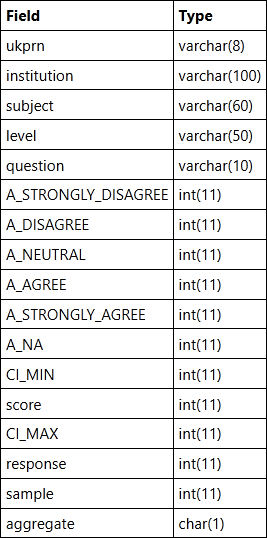

<!-- omit in toc -->
# Tutorials: Learn SQL step by step

This file contains the solutions (SQL queries) to the tutorial's questions posed by <https://sqlzoo.net/wiki/SQL_Tutorial>.


<!-- omit in toc -->
## Table of Contents

- [0 SELECT basics (last edited 20/07/2025)](#0-select-basics-last-edited-20072025)
- [1 SELECT name (last edited 21/07/2025)](#1-select-name-last-edited-21072025)
- [2 SELECT from WORLD Tutorial (last edited 20/07/2025)](#2-select-from-world-tutorial-last-edited-20072025)
- [3 SELECT from Nobel (last edited 20/07/2025)](#3-select-from-nobel-last-edited-20072025)
- [4 SELECT within SELECT Tutorial (last edited 20/07/2025)](#4-select-within-select-tutorial-last-edited-20072025)
- [5 SUM and COUNT (last edited 22/07/2025)](#5-sum-and-count-last-edited-22072025)
- [\*The nobel table can be used to practice more SUM and COUNT functions (last edited 23/07/2025)](#the-nobel-table-can-be-used-to-practice-more-sum-and-count-functions-last-edited-23072025)
- [6 The JOIN operation (last edited 24/07/2025)](#6-the-join-operation-last-edited-24072025)
- [\*Old JOIN Tutorial (last edited 25/07/2025)](#old-join-tutorial-last-edited-25072025)
- [\*Music Tutorial (last edited 26/07/2025)](#music-tutorial-last-edited-26072025)
- [7 More JOIN operations (last edited 27/07/2025)](#7-more-join-operations-last-edited-27072025)
- [8 Using Null (last edited 30/07/2025)](#8-using-null-last-edited-30072025)
- [\*Scottish Parliament (last edited 31/07/2025)](#scottish-parliament-last-edited-31072025)
- [8+ NSS Tutorial (Numeric Examples) (last edited 01/08/2025)](#8-nss-tutorial-numeric-examples-last-edited-01082025)
- [9- Window functions (last edited 02/08/2025)](#9--window-functions-last-edited-02082025)
- [9+ Window LAG (COVID 19) (last edited 04/08/2025)](#9-window-lag-covid-19-last-edited-04082025)
- [9 Self Join (last edited 05/08/2025)](#9-self-join-last-edited-05082025)


## 0 SELECT basics (last edited 20/07/2025)

Webpage: <https://sqlzoo.net/wiki/SELECT_basics>.

Introducing the world table of countries

<div id="header" align="center">

  

</div>


<!-- omit in toc -->
### 1. The example uses a WHERE clause to show the population of 'France'. Note that strings should be in 'single quotes'; _Modify it to show the population of Germany_

```SQL
SELECT population
  FROM world
 WHERE name = 'Germany'

```

---


<!-- omit in toc -->
### 2. Checking a list The word _IN_ allows us to check if an item is in a list. The example shows the name and population for the countries 'Brazil', 'Russia', 'India' and 'China'. _Show the name and the population for 'Sweden', 'Norway' and 'Denmark'_

```SQL
SELECT name, population
  FROM world
 WHERE name IN ('Sweden', 'Norway', 'Denmark')
```

---


<!-- omit in toc -->
### 3. Which countries are not too small and not too big? `BETWEEN` allows range checking (range specified is inclusive of boundary values). The example below shows countries with an area of 250,000-300,000 sq. km. Modify it to show the country and the area for countries with an area between 200,000 and 250,000

```SQL
SELECT name, area
  FROM world
 WHERE area BETWEEN 200000 AND 250000
```


<br />

> [!NOTE]
> <div align="center">
>
> [_***Accompanying SELECT Quiz***_](./Quizzes.md#1-select-quiz)
>
> </div>


<div align="right">

  [](#table-of-contents)
</div>

---


## 1 SELECT name (last edited 21/07/2025)

Webpage: <https://sqlzoo.net/wiki/SELECT_names>.


<!-- omit in toc -->
### 1. You can use WHERE name LIKE 'B%' to find the countries that start with "B"

- The % is a wild-card it can match any characters

**Find the country that start with Y**


```SQL
SELECT name
  FROM world
 WHERE name LIKE 'Y%'
```

---


<!-- omit in toc -->
### 2. _Find the countries that end with y_

```SQL
SELECT name
  FROM world
 WHERE name LIKE '%y'
```

---


<!-- omit in toc -->
### 3. Luxembourg has an _x_ - so does one other country. List them both. _Find the countries that contain the letter x_

```SQL
SELECT name
  FROM world
 WHERE name LIKE '%x%'
```

---


<!-- omit in toc -->
### 4. Iceland, Switzerland end with _land_ - but are there others? _Find the countries that end with land_

```SQL
SELECT name
  FROM world
 WHERE name LIKE '%land'
```

---


<!-- omit in toc -->
### 5. Columbia starts with a _C_ and ends with _ia_ - there are two more like this. _Find the countries that start with C and end with ia_

```SQL
SELECT name
  FROM world
 WHERE name LIKE 'C%ia'
```

---


<!-- omit in toc -->
### 6. Greece has a double _e_ - who has a double _o_? _Find the country that has oo in the name_

```SQL
SELECT name
  FROM world
 WHERE name LIKE '%oo%'
```

---


<!-- omit in toc -->
### 7. Bahamas has three _a_ - who else? _Find the countries that have three or more a in the name_

```SQL
SELECT name
  FROM world
 WHERE name LIKE '%a%a%a%'
```

---


<!-- omit in toc -->
### 8. India and Angola have an _n_ as the second character. You can use the underscore as a single character wildcard. _Find the countries that have "t" as the second character_

```SQL
SELECT name
  FROM world
 WHERE name LIKE '_t%'
```

---


<!-- omit in toc -->
### 9. Lesotho and Moldova both have two o characters separated by two other characters. _Find the countries that have two "o" characters separated by two others._

```SQL
SELECT name
  FROM world
 WHERE name LIKE '%o__o%'
```

> [!NOTE]
> This query matches *characters* and not *letters* because "_" can be a whitespace (or any other character).


---


<!-- omit in toc -->
### 10. uba and Togo have four characters names. _Find the countries that have exactly four characters_

```SQL
SELECT name
  FROM world
 WHERE name LIKE '____'
```

---


<!-- omit in toc -->
### 11. The capital of _Luxembourg_ is _Luxembourg_. Show all the countries where the capital is the same as the name of the country. _Find the country where the name is the capital city_

```SQL
SELECT name
  FROM world
 WHERE name = capital
```

---


<!-- omit in toc -->
### 12. The capital of _Mexico_ is _Mexico City_. Show all the countries where the capital has the country together with the word "City". _Find the country where the capital is the country plus "City"_

```SQL
SELECT name
  FROM world
 WHERE capital = CONCAT(name, ' City')
```

---


<!-- omit in toc -->
### 13. _Find the capital and the name where the capital includes the name of the country_

```SQL
SELECT capital, name
  FROM world
 WHERE capital LIKE CONCAT('%', name, '%')
```

---


<!-- omit in toc -->
### 14. _Find the capital and the name where the capital is an extension of name of the country._ You should include _Mexico City_ as it is longer than _Mexico_. You should not include _Luxembourg_ as the capital is the same as the country

```SQL
SELECT capital, name
  FROM world
 WHERE capital LIKE CONCAT('%', name, '%')
   AND capital != name
```

---


<!-- omit in toc -->
### 15. The capital of _Monaco_ is _Monaco-Ville_: this is the name _Monaco_ and the extension is _-Ville_. _Show the name and the extension where the capital is a proper (non-empty) extension of name of the country_

```SQL
SELECT name, REPLACE(capital, name, '') AS extension
  FROM world
 WHERE capital LIKE CONCAT('%', name, '%')
   AND capital != name
```

<div align="right">

  [](#table-of-contents)
</div>

---


## 2 SELECT from WORLD Tutorial (last edited 20/07/2025)

Webpage: <https://sqlzoo.net/wiki/SELECT_from_WORLD_Tutorial>.


<!-- omit in toc -->
### 1. [Read the notes about this table](https://sqlzoo.net/wiki/Read_the_notes_about_this_table.). Observe the result of running this SQL command to show the name, continent and population of all countries

```SQL
SELECT name, continent, population
  FROM world
```

---


<!-- omit in toc -->
### 2. [How to use WHERE to filter records](https://sqlzoo.net/wiki/WHERE_filters). Show the name for the countries that have a population of at least 200 million. 200 million is 200000000, there are eight zeros

```SQL
SELECT name
  FROM world
 WHERE population > 200000000
```

---


<!-- omit in toc -->
### 3. Give the `name` and the _per capita GDP_ for those countries with a `population` of at least 200 million

```SQL
SELECT name, gdp/population
  FROM world
 WHERE population > 200000000
```

---


<!-- omit in toc -->
### 4. Show the `name` and `population` in millions for the countries of the `continent` 'South America'. Divide the population by 1000000 to get population in millions

```SQL
SELECT name, population/1000000
  FROM world
 WHERE continent LIKE 'South America'
```

---


<!-- omit in toc -->
### 5. Show the `name` and `population` for France, Germany, Italy

```SQL
SELECT name, population
  FROM world
 WHERE name IN ('France', 'Germany', 'Italy')
```

---


<!-- omit in toc -->
### 6. Show the countries which have a `name` that includes the word 'United'

```SQL
SELECT name
  FROM world
 WHERE name LIKE '%United%'
```

---


<!-- omit in toc -->
### 7. Two ways to be big: A country is _big_ if it has an area of more than 3 million sq km or it has a population of more than 250 million. _Show the countries that are big by area or big by population. Show name, population and area_

```SQL
SELECT name, population, area
  FROM world
 WHERE (population > 250000000) OR (area > 3000000)
```

---


<!-- omit in toc -->
### 8. Exclusive OR (XOR). Show the countries that are big by area (more than 3 million) or big by population (more than 250 million) but not both. Show name, population and area

- Australia has a big area but a small population, it should be included.
- Indonesia has a big population but a small area, it should be included.
- China has a big population and big area, it should be excluded.
- United Kingdom has a small population and a small area, it should be excluded.

```SQL
SELECT name, population, area
  FROM world
 WHERE (population > 250000000) XOR (area > 3000000)
```

---


<!-- omit in toc -->
### 9. Show the `name` and `population` in millions and the GDP in billions for the countries of the `continent` 'South America'. Use the [ROUND](https://sqlzoo.net/wiki/ROUND) function to show the values to two decimal places. _For Americas show population in millions and GDP in billions both to 2 decimal places_

```SQL
SELECT name, ROUND(population/1000000, 2), ROUND(gdp/1000000000, 2)
  FROM world
 WHERE continent = 'South America'
```

---


<!-- omit in toc -->
### 10. Show the `name` and per-capita GDP for those countries with a GDP of at least one trillion (1000000000000; that is 12 zeros). Round this value to the nearest 1000. _Show per-capita GDP for the trillion dollar countries to the nearest $1000_

```SQL
SELECT name, ROUND(gdp/population, -3)
  FROM world
 WHERE gdp > 1000000000000
```

---


<!-- omit in toc -->
### 11. Greece has capital Athens. Each of the strings 'Greece', and 'Athens' has 6 characters. _Show the name and capital where the name and the capital have the same number of characters._

- You can use the LENGTH function to find the number of characters in a string
  - For Microsoft SQL Server the function LENGTH is LEN

```SQL
SELECT name, capital
  FROM world
 WHERE LENGTH(name) = LENGTH(capital)
```

---


<!-- omit in toc -->
### 12. The capital of Sweden is Stockholm. Both words start with the letter 'S'. _Show the name and the capital where the first letters of each match. Don't include countries where the name and the capital are the same word_

- You can use the function LEFT to isolate the first character.
- You can use <> as the NOT EQUALS operator.

```SQL
SELECT name, capital
  FROM world
 WHERE LEFT(name, 1) = LEFT(capital, 1)
   AND name <> capital
```

---


<!-- omit in toc -->
### 13. _Equatorial Guinea_ and _Dominican Republic_ have all of the vowels (a e i o u) in the name. They don't count because they have more than one word in the name. _Find the country that has all the vowels and no spaces in its name_

- You can use the phrase name `NOT LIKE '%a%'` to exclude characters from your results.
- The query shown misses countries like Bahamas and Belarus because they contain at least one 'a'

```SQL
SELECT name
  FROM world
 WHERE name LIKE '%a%'
   AND name LIKE '%e%'
   AND name LIKE '%i%'
   AND name LIKE '%o%'
   AND name LIKE '%u%'
   AND name NOT LIKE '% %'
```


<br />

> [!NOTE]
> <div align="center">
>
> [_***Accompanying BBC Quiz***_](./Quizzes.md#2-bbc-quiz)
>
> </div>


<div align="right">

  [](#table-of-contents)
</div>

---


## 3 SELECT from Nobel (last edited 20/07/2025)

Webpage: <https://sqlzoo.net/wiki/SELECT_from_Nobel_Tutorial>.


<!-- omit in toc -->
### 1. Change the query shown so that it displays Nobel prizes for 1950

```SQL
SELECT yr, subject, winner
  FROM nobel
 WHERE yr = 1950
```

---


<!-- omit in toc -->
### 2. Show who won the 1962 prize for literature

```SQL
SELECT winner
  FROM nobel
 WHERE yr = 1962
   AND subject = 'literature'
```

---


<!-- omit in toc -->
### 3. Show the year and subject that won 'Albert Einstein' his prize

```SQL
SELECT yr, subject
  FROM nobel
 WHERE winner = 'Albert Einstein'
```

---


<!-- omit in toc -->
### 4. Give the name of the 'peace' winners since the year 2000, including 2000

```SQL
SELECT winner
  FROM nobel
 WHERE yr >= 2000
   AND subject = 'peace'
```

---


<!-- omit in toc -->
### 5. Show all details (_yr_, _subject_, _winner_) of the literature prize winners for 1980 to 1989 inclusive

```SQL
SELECT yr, subject, winner
  FROM nobel
 WHERE yr BETWEEN 1980 AND 1989
   AND subject = 'literature'
```

---


<!-- omit in toc -->
### 6. Show all details of the presidential winners

- Theodore Roosevelt
- Thomas Woodrow Wilson
- Jimmy Carter
- Barack Obama

```SQL
SELECT yr, subject, winner
  FROM nobel
 WHERE winner = 'Theodore Roosevelt'
    OR winner = 'Thomas Woodrow Wilson'
    OR winner = 'Jimmy Carter'
    OR winner = 'Barack Obama'
```

---


<!-- omit in toc -->
### 7. Show the winners with first name John

```SQL
SELECT winner
  FROM nobel
 WHERE winner LIKE 'John %'
```

---


<!-- omit in toc -->
### 8. _Show the year, subject, and name of physics winners for 1980 together with the chemistry winners for 1984_

```SQL
SELECT yr, subject, winner
  FROM nobel
 WHERE (yr = 1980 AND subject = 'physics')
    OR (yr = 1984 AND subject = 'chemistry')
```

---


<!-- omit in toc -->
### 9. _Show the year, subject, and name of winners for 1980 excluding chemistry and medicine_

```SQL
SELECT yr, subject, winner
  FROM nobel
 WHERE yr = 1980
   AND subject NOT LIKE 'chemistry'
   AND subject NOT LIKE 'medicine'
```

---


<!-- omit in toc -->
### 10. Show year, subject, and name of people who won a 'Medicine' prize in an early year (before 1910, not including 1910) together with winners of a 'Literature' prize in a later year (after 2004, including 2004)

```SQL
SELECT yr, subject, winner
  FROM nobel
 WHERE yr <  1910 AND subject LIKE 'medicine'
    OR yr >= 2004 AND subject LIKE 'literature'
```

---


<!-- omit in toc -->
### 11. Find all details of the prize won by PETER GRÜNBERG

```SQL
SELECT yr, subject, winner
  FROM nobel
 WHERE winner = 'PETER GRÜNBERG'
```

---


<!-- omit in toc -->
### 12. Find all details of the prize won by EUGENE O'NEILL

```SQL
SELECT yr, subject, winner
  FROM nobel
 WHERE winner = 'Eugene O\'Neill'
```

> Alternative query
>
> ```SQL
> SELECT yr, subject, winner
>   FROM nobel
>  WHERE winner = 'Eugene O''Neill'
> ```
>
> Note the double apostrophe vs a "\\" to escape the " ' " in "O'Neil

---


<!-- omit in toc -->
### 13. Knights in order. _List the winners, year and subject where the winner starts with Sir. Show the the most recent first, then by name order_

```SQL
SELECT winner, yr, subject
  FROM nobel
 WHERE winner LIKE 'Sir%'
 ORDER BY yr DESC, winner ASC
```

---


<!-- omit in toc -->
### 14. The expression _subject IN ('chemistry','physics')_ can be used as a value - it will be _0_ or _1_. _Show the 1984 winners and subject ordered by subject and winner name; but list chemistry and physics last_

```SQL
WITH science AS (
  SELECT winner, subject, yr, subject IN ('physics', 'chemistry') AS is_science
  FROM nobel
)

SELECT winner, subject
  FROM science
 WHERE yr = 1984
 ORDER BY is_science ASC, subject ASC, winner ASC
```

> Alternative query
>
> ```SQL
> SELECT winner, subject
>   FROM nobel
>  WHERE yr = 1984
>  ORDER BY subject IN ('physics', 'chemistry') ASC, subject ASC, winner ASC
> ```
>
> Note that this (and I assume my first answer) apparently does not work in ORACLE based SQL, so better to use the following answer for cross SQL provider compatibility
>
> ```SQL
> SELECT winner, subject
>   FROM nobel
>  WHERE yr = 1984
>  ORDER BY CASE WHEN subject IN ('physics', 'chemistry') THEN 1 ELSE 0 END ASC, subject ASC, winner ASC
> ```


<br />

> [!NOTE]
> <div align="center">
>
> [_***Accompanying Nobel Quiz***_](./Quizzes.md#3-nobel-quiz)
>
> </div>


<div align="right">

  [](#table-of-contents)
</div>

---


## 4 SELECT within SELECT Tutorial (last edited 20/07/2025)

Webpage: <https://sqlzoo.net/wiki/SELECT_within_SELECT_Tutorial>.


<!-- omit in toc -->
### 1. _List each country name where the population is larger than that of 'Russia'_

```SQL
SELECT name
  FROM world
 WHERE population > (SELECT population
                       FROM world
                      WHERE name='Russia')
```

---


<!-- omit in toc -->
### 2. _Show the countries in Europe with a per capita GDP greater than 'United Kingdom'_

```SQL
SELECT name
  FROM world
 WHERE continent = 'Europe'
   AND gdp/population > (SELECT gdp/population
                           FROM world
                          WHERE name='United Kingdom')
```

---


<!-- omit in toc -->
### 3. _List the name and continent of countries in the continents containing either Argentina or Australia. Order by name of the country_

```SQL
SELECT name, continent
  FROM world
 WHERE continent IN
       (SELECT continent
          FROM world
         WHERE name IN ('Argentina', 'Australia'))
ORDER BY name
```

---


<!-- omit in toc -->
### 4. _Which country has a population that is more than United Kingdom but less than Germany? Show the name and the population_

```SQL
SELECT name, population
  FROM world
 WHERE population >
       (SELECT population
          FROM world
         WHERE name = 'United Kingdom')
   AND population <
       (SELECT population
          FROM world
         WHERE name = 'Germany')
```

---


<!-- omit in toc -->
### 5. Germany (population roughly 80 million) has the largest population of the countries in Europe. Austria (population 8.5 million) has 11% of the population of Germany. _Show the name and the population of each country in Europe. Show the population as a percentage of the population of Germany_

```SQL
SELECT name,
       CONCAT(ROUND(100*population/(SELECT population
                                      FROM world
                                     WHERE name = 'Germany'), 0), '%') AS percentage
  FROM world
 WHERE continent = 'Europe'
```

<!-- FIXME: redo query -->
> Alternative query mostly for syntax reasons to be a little easier on the eyes/brain, but it is also more complex/verbose and probably less performant since its doing a Cartesian product between the tables? Even though I really only need a singular value `population_germany`, but trying to `DECLARE` or `SET` it I kept running into MariaDB/SQL errors.
>
> ```SQL
> WITH Germany AS (
>   SELECT population
>     FROM world
>    WHERE name = 'Germany'
>    LIMIT 1
> )
> 
> SELECT w.name, CONCAT(ROUND(100*w.population/g.population, 0), '%') AS percentage
>   FROM world AS w
>  CROSS JOIN Germany AS g
>  WHERE continent = 'Europe'
> ```

---


<!-- omit in toc -->
### 6. _Which countries have a GDP greater than every country in Europe? [Give the name only.] (Some countries may have NULL gdp values)_

```SQL
SELECT name
  FROM world
 WHERE gdp > ALL(SELECT gdp
                   FROM world
                  WHERE gdp > 0 AND continent = 'Europe')
```

---


<!-- omit in toc -->
### 7. _Find the largest country (by area) in each continent, show the continent, the name and the area:_ The above example is known as a _correlated_ or _synchronized_ sub-query

```SQL
SELECT continent, name, area
  FROM world AS x
 WHERE area >= ALL(SELECT area
                     FROM world AS y
                    WHERE y.continent = x.continent)
```

---


<!-- omit in toc -->
### 8. _List each continent and the name of the country that comes first alphabetically_

```SQL
SELECT continent, MIN(name) AS name
  FROM world
 GROUP BY continent
 ORDER BY continent
```

---


<!-- omit in toc -->
### 9. _Find the continents where all countries have a population <= 25000000. Then find the names of the countries Accompanying with these continents. Show name, continent and population_

```SQL
SELECT name, continent, population
  FROM world
 WHERE continent IN (SELECT continent
                       FROM world
                      GROUP BY continent
                     HAVING MAX(population) <= 25000000)
```

> Alternative query
>
> ```SQL
> SELECT name, continent, population
>   FROM world AS x
>  WHERE 25000000 >= ALL(SELECT y.population
>                          FROM world AS y
>                         WHERE y.continent = x.continent)
> ```

---


<!-- omit in toc -->
### 10. _Some countries have populations more than three times that of all of their neighbours (in the same continent). Give the countries and continents_

```SQL
SELECT name, continent
  FROM world AS x
 WHERE x.population > ALL(SELECT 3*y.population
                            FROM world AS y
                           WHERE y.continent = x.continent
                             AND y.name <> x.name)
```

> Alternative query
>
> ```SQL
> SELECT w1.name, w1.continent
>   FROM world AS w1
>  WHERE w1.population > (SELECT 3 * MAX(w2.population)
>                           FROM world AS w2
>                          WHERE w2.continent = w1.continent
>                            AND w2.name <> w1.name)
> ```


<br />

> [!NOTE]
> <div align="center">
>
> [_***Accompanying Nested SELECT Quiz***_](./Quizzes.md#4-nested-select-quiz)
>
> </div>


<div align="right">

  [](#table-of-contents)
</div>

---


## 5 SUM and COUNT (last edited 22/07/2025)

Webpage: <https://sqlzoo.net/wiki/SUM_and_COUNT>.


<!-- omit in toc -->
### 1. Show the total _population_ of the world

```SQL
SELECT SUM(population)
  FROM world
```

---


<!-- omit in toc -->
### 2. List all the continents - just once each

```SQL
SELECT MAX(continent)
  FROM world
 GROUP BY continent
```

> Alternative query
>
> ```SQL
> SELECT MIN(continent)
>   FROM world
>  GROUP BY continent
> ```
>
> And probably the best answer
>
> ```SQL
> SELECT DISTINCT continent
>   FROM world
> ```

---


<!-- omit in toc -->
### 3. Give the total GDP of Africa

```SQL
SELECT SUM(gdp)
  FROM world
 WHERE continent = 'Africa'
```

---


<!-- omit in toc -->
### 4. How many countries have an _area_ of at least 1000000

```SQL
SELECT COUNT(name)
  FROM world
 WHERE area >= 1000000
```

---


<!-- omit in toc -->
### 5. What is the total _population_ of ('Estonia', 'Latvia', 'Lithuania')

```SQL
SELECT SUM(population)
  FROM world
 WHERE name IN ('Estonia', 'Latvia', 'Lithuania') 
```

---


<!-- omit in toc -->
### 6. For each _continent_ show the _continent_ and number of countries

```SQL
SELECT continent, COUNT(name)
  FROM world
 GROUP BY continent
```

---


<!-- omit in toc -->
### 7. For each _continent_ show the _continent_ and number of countries with populations of at least 10 million

```SQL
SELECT continent, COUNT(name)
  FROM world
 WHERE population > 10000000
 GROUP BY continent
```

---


<!-- omit in toc -->
### 8. List the continents that _have_ a total population of at least 100 million

```SQL
SELECT continent
  FROM world
 GROUP BY continent
HAVING SUM(population) > 100000000
```


<br />

> [!NOTE]
> <div align="center">
>
> [_***Accompanying SUM and COUNT Quiz***_](./Quizzes.md#5-sum-and-count-quiz-last-edited-22072025)
>
> </div>


<div align="right">

  [](#table-of-contents)
</div>

---


## *The nobel table can be used to practice more SUM and COUNT functions (last edited 23/07/2025)

Another tutorial for aggregate functions (<https://sqlzoo.net/wiki/The_nobel_table_can_be_used_to_practice_more_SUM_and_COUNT_functions.>) using the Nobel table introduced in the [SELECT basics section](#0-select-basics-last-edited-20072025)


<!-- omit in toc -->
### 1. Show the total number of prizes awarded

```SQL
SELECT COUNT(winner)
  FROM nobel
```

---


<!-- omit in toc -->
### 2. List each subject - just once

```SQL
SELECT DISTINCT subject
  FROM nobel
```

---


<!-- omit in toc -->
### 3. Show the total number of prizes awarded for Physics

```SQL
SELECT COUNT(winner)
  FROM nobel
 WHERE subject = 'Physics'
```

---


<!-- omit in toc -->
### 4. For each subject show the subject and the number of prizes

```SQL
SELECT subject, COUNT(winner)
  FROM nobel
 GROUP BY subject
```

---


<!-- omit in toc -->
### 5. For each subject show the first year that the prize was awarded

```SQL
SELECT subject, MIN(yr)
  FROM nobel
 GROUP BY subject
```

---


<!-- omit in toc -->
### 6. For each subject show the number of prizes awarded in the year 2000

```SQL
SELECT subject, COUNT(winner)
  FROM nobel
 WHERE yr = 2000
 GROUP BY subject
```

---


<!-- omit in toc -->
### 7. Show the number of different winners for each subject. Be aware that [Frederick Sanger](https://en.wikipedia.org/wiki/Frederick_Sanger) has won the chemistry prize twice - he should only be counted once

```SQL
SELECT subject, COUNT(DISTINCT winner)
  FROM nobel
 GROUP BY subject
```

---


<!-- omit in toc -->
### 8. For each subject show how many years have had prizes awarded

```SQL
SELECT subject, COUNT(DISTINCT yr)
  FROM nobel
 GROUP BY subject
```

---


<!-- omit in toc -->
### 9. Show the years in which three prizes were given for Physics

```SQL
SELECT yr
  FROM nobel
 WHERE subject = 'Physics'
 GROUP BY yr
HAVING COUNT(winner) = 3
```

---


<!-- omit in toc -->
### 10. Show winners who have won more than once

```SQL
SELECT winner
  FROM nobel
 GROUP BY winner
HAVING COUNT(winner) > 1
```

---


<!-- omit in toc -->
### 11. Show winners who have won more than one subject

```SQL
SELECT winner
  FROM nobel
 GROUP BY winner
HAVING COUNT(DISTINCT subject) > 1
```

---


<!-- omit in toc -->
### 12. Show the year and subject where 3 prizes were given. Show only years 2000 onwards

```SQL
SELECT yr, subject
  FROM nobel
 WHERE yr >= 2000
 GROUP BY yr, subject
HAVING COUNT(winner) = 3
```


<div align="right">

  [](#table-of-contents)
</div>

---


## 6 The JOIN operation (last edited 24/07/2025)

Webpage: <https://sqlzoo.net/wiki/The_JOIN_operation>.

UEFA EURO 2012 Database,

<div id="header" align="center">

  

</div>


<!-- omit in toc -->
### 1. The first example shows the goal scored by a player with the last name 'Bender'. The `*` says to list all the columns in the table - a shorter way of saying `matchid, teamid, player, gtime`. _Modify it to show the matchid and player name for all goals scored by Germany. To identify German players, check for: `teamid = 'GER'`_

```SQL
SELECT matchid, player
  FROM goal
 WHERE teamid = 'GER'
```

---


<!-- omit in toc -->
### 2. From the previous query you can see that Lars Bender's scored a goal in game 1012. Now we want to know what teams were playing in that match. Notice in the that the column `matchid` in the `goal` table corresponds to the `id` column in the `game` table. We can look up information about game 1012 by finding that row in the _game_ table. _Show id, stadium, team1, team2 for just game 1012_

```SQL
SELECT id, stadium, team1, team2
  FROM game
 WHERE id = 1012
```

---


<!-- omit in toc -->
### 3. You can combine the two steps into a single query with a JOIN

```SQL
SELECT *
  FROM game
  JOIN goal ON (id=matchid)
```

The **FROM** clause says to merge data from the goal table with that from the game table. The **ON** says how to figure out which rows in **game** go with which rows in **goal** - the **matchid** from **goal** must match **id** from **game**. (If we wanted to be more clear/specific we could say
`ON (game.id=goal.matchid)`)

The code below shows the player (from the goal) and stadium name (from the game table) for every goal scored.

_Modify it to show the player, teamid, stadium and mdate for every German goal._


```SQL
SELECT goal.player, goal.teamid, game.stadium, game.mdate
  FROM game
  JOIN goal ON (game.id=goal.matchid)
 WHERE goal.teamid = 'GER'
```

---


<!-- omit in toc -->
### 4. Use the same JOIN as in the previous question. _Show the team1, team2 and player for every goal scored by a player called Mario `player LIKE 'Mario%'`_

```SQL
SELECT game.team1, game.team2, goal.player
  FROM game
  JOIN goal ON (game.id=goal.matchid)
 WHERE goal.player LIKE 'Mario%'
```

---


<!-- omit in toc -->
### 5. The table `eteam` gives details of every national team including the coach. You can `JOIN` `goal` to `eteam` using the phrase `goal JOIN eteam on teamid=id` _Show `player`, `teamid`, `coach`, `gtime` for all goals scored in the first 10 minutes `gtime<=10`_

```SQL
SELECT goal.player, goal.teamid, eteam.coach, goal.gtime
  FROM goal
  JOIN eteam ON (eteam.id=goal.teamid)
 WHERE goal.gtime <= 10
```

---


<!-- omit in toc -->
### 6. To `JOIN` `game` with `eteam` you could use either `game JOIN eteam ON (team1=eteam.id)` or `game JOIN eteam ON (team2=eteam.id)`. Notice that because `id` is a column name in both `game` and `eteam` you must specify `eteam.id` instead of just `id`. _List the dates of the matches and the name of the team in which 'Fernando Santos' was the team1 coach._

```SQL
SELECT game.mdate, eteam.teamname
  FROM game
  JOIN eteam ON (eteam.id=game.team1)
 WHERE eteam.coach = 'Fernando Santos'
```

---


<!-- omit in toc -->
### 7. List the player for every goal scored in a game where the stadium was 'National Stadium, Warsaw'

```SQL
SELECT goal.player
  FROM goal
  JOIN game ON (goal.matchid=game.id)
 WHERE game.stadium = 'National Stadium, Warsaw'
```

---


<!-- omit in toc -->
### 8. The example query shows all goals scored in the Germany-Greece quarterfinal. _Instead show the name of all players who scored a goal against Germany._

```SQL
SELECT DISTINCT player
  FROM game
  JOIN goal ON (game.id=goal.matchid)
 WHERE (game.team1 = 'GER' AND goal.teamid = game.team2)
    OR (game.team2 = 'GER' AND goal.teamid = game.team1)
```

---


<!-- omit in toc -->
### 9. Show teamname and the total number of goals scored

```SQL
SELECT eteam.teamname, COUNT(goal.player) AS goals
  FROM eteam
  JOIN goal ON eteam.id=goal.teamid
 GROUP BY teamname
```

---


<!-- omit in toc -->
### 10. Show the stadium and the number of goals scored in each stadium

```SQL
SELECT game.stadium, COUNT(goal.player) AS goals
  FROM game
  JOIN goal ON game.id=goal.matchid
 GROUP BY game.stadium
```

---


<!-- omit in toc -->
### 11. For every match involving 'POL', show the matchid, date and the number of goals scored

```SQL
SELECT goal.matchid, game.mdate, COUNT(goal.player)
  FROM goal
  JOIN game ON goal.matchid=game.id
 WHERE (team1 = 'POL' OR team2 = 'POL')
 GROUP BY goal.matchid, game.mdate
```

---


<!-- omit in toc -->
### 12. For every match where 'GER' scored, show matchid, match date and the number of goals scored by 'GER'

```SQL
SELECT goal.matchid, game.mdate, COUNT(goal.player)
  FROM goal
  JOIN game ON goal.matchid=game.id
 WHERE goal.teamid = 'GER'
 GROUP BY goal.matchid, game.mdate
```

---


<!-- omit in toc -->
### 13. List every match with the goals scored by each team as shown. This will use "[CASE WHEN](https://sqlzoo.net/wiki/CASE)" which has not been explained in any previous exercises

```SQL
SELECT game.mdate,
       game.team1,
       SUM(CASE WHEN goal.teamid = game.team1 THEN 1 ELSE 0 END) AS score1,
       game.team2,
       SUM(CASE WHEN goal.teamid = game.team2 THEN 1 ELSE 0 END) AS score2
  FROM game LEFT
  JOIN goal ON game.id = goal.matchid
 GROUP BY game.mdate, game.team1, game.team2
 ORDER BY game.mdate, goal.matchid, game.team1, game.team2
```

> [!NOTE]
> The `LEFT JOIN` is needed to make sure that scoreless games (which are not listed in the `game` table) still show up with a `0` for both `score1` and `score2`.


<br />

> [!NOTE]
> <div align="center">
>
> [_***Accompanying JOIN Quiz***_](./Quizzes.md#6-join-quiz-last-edited-27072025)
>
> </div>


<div align="right">

  [](#table-of-contents)
</div>

---


## *Old JOIN Tutorial (last edited 25/07/2025)

Another older tutorial for JOIN operations (<https://sqlzoo.net/wiki/Old_JOIN_Tutorial>).

The Table Tennis Olympics Database

<div align="center">

  

</div>

The Woman's Singles Table Tennis Olympics Database

<div align="center">

  

</div>

The Table Tennis Mens Doubles

<div align="center">

  

</div>


<!-- omit in toc -->
### 1. Show the athelete `(who)` and the country name for medal winners in 2000

```SQL
SELECT ttms.who, country.name
  FROM ttms
  JOIN country ON (ttms.country=country.id)
 WHERE games = 2000
```

---


<!-- omit in toc -->
### 2. Show the who and the color of the medal for the medal winners from 'Sweden'

```SQL
SELECT ttms.who, ttms.color
  FROM ttms
  JOIN country ON (ttms.country=country.id)
 WHERE country.name = 'Sweden'
```

---


<!-- omit in toc -->
### 3. Show the years in which 'China' won a 'gold' medal

```SQL
SELECT ttms.games
  FROM ttms
  JOIN country ON (ttms.country=country.id)
 WHERE country.name = 'China'
   AND ttms.color = 'gold'
```

---


<!-- omit in toc -->
### 4. Show who `won` medals in the 'Barcelona' games

```SQL
SELECT ttws.who
  FROM ttws
  JOIN games ON (ttws.games=games.yr)
 WHERE city = 'Barcelona'
```

---


<!-- omit in toc -->
### 5. Show which city 'Jing Chen' won medals. Show the `city` and the medal `color`

```SQL
SELECT games.city, ttws.color
  FROM ttws
  JOIN games ON (ttws.games=games.yr)
 WHERE ttws.who = 'Jing Chen'
```

---


<!-- omit in toc -->
### 6. Show `who` won the gold medal and the `city`

```SQL
SELECT ttws.who, games.city
  FROM ttws
  JOIN games ON (ttws.games=games.yr)
 WHERE ttws.color = 'gold'
```

---


<!-- omit in toc -->
### 7. Show the games and color of the medal won by the team that includes 'Yan Sen'

```SQL
SELECT ttmd.games, ttmd.color
  FROM ttmd
  JOIN team ON (ttmd.team=team.id)
 WHERE team.name = 'Yan Sen'
```

---


<!-- omit in toc -->
### 8. Show the 'gold' medal winners in 2004

```SQL
SELECT team.name
  FROM team
  JOIN ttmd ON (team.id=ttmd.team)
 WHERE ttmd.games = 2004
   AND ttmd.color = 'gold'
```

---


<!-- omit in toc -->
### 9. Show the name of each medal winner country 'FRA'

```SQL
SELECT team.name
  FROM team
  JOIN ttmd ON (team.id=ttmd.team)
 WHERE ttmd.country = 'FRA'
```


<div align="right">

  [](#table-of-contents)
</div>

---


## *Music Tutorial (last edited 26/07/2025)

Yet another (older) tutorial for JOIN operations (<https://sqlzoo.net/wiki/Music_Tutorial>).

The Music Database

<div align="center">

  

</div>


<!-- omit in toc -->
### 1. Find the `title` and `artist` who recorded the `song` `'Alison'`

```SQL
SELECT album.title, album.artist
  FROM album
  JOIN track ON (album.asin=track.album)
 WHERE song = 'Alison'
```

---


<!-- omit in toc -->
### 2. Which `artist` recorded the `song` `'Exodus'`

```SQL
SELECT album.artist
  FROM album
  JOIN track ON (album.asin=track.album)
 WHERE track.song = 'Exodus'
```

---


<!-- omit in toc -->
### 3. Show the `song` for each `track` on the `album` `'Blur'`

```SQL
SELECT track.song
  FROM album
  JOIN track ON (album.asin=track.album)
 WHERE album.title = 'Blur'
```

---


<!-- omit in toc -->
### 4. For each `album` show the `title` and the total number of `track`

```SQL
SELECT album.title, COUNT(track.song)
  FROM album
  JOIN track ON (album.asin=track.album)
 GROUP BY title
```

---


<!-- omit in toc -->
### 5. For each `album` show the `title` and the total number of tracks containing the word `'Heart'` (albums with no such tracks need not be shown)

```SQL
SELECT album.title, COUNT(track.song)
  FROM album
  JOIN track ON (album.asin=track.album)
 WHERE track.song LIKE '%Heart%'
 GROUP BY title
```

---


<!-- omit in toc -->
### 6. A "title track" is where the `song` is the same as the `title`. Find the title tracks

```SQL
SELECT track.song
  FROM track
  JOIN album ON (track.album=album.asin)
 WHERE track.song = album.title
```

---


<!-- omit in toc -->
### 7. An "eponymous" album is one where the title is the same as the artist (for example the album `'Blur'` by the band `'Blur'`). Show the eponymous albums

```SQL
SELECT title
  FROM album
 WHERE title = artist
```

---


<!-- omit in toc -->
### 8. Find the songs that appear on more than 2 albums. Include a count of the number of times each shows up

```SQL
SELECT track.song, COUNT(DISTINCT track.album)
  FROM track
  JOIN album ON (track.album=album.asin)
 GROUP BY track.song
HAVING COUNT(DISTINCT track.album) > 2
```

---


<!-- omit in toc -->
### 9. A "good value" album is one where the price per track is less than 50 pence. Find the good value album - show the title, the price and the number of tracks

```SQL
SELECT album.title, album.price, COUNT(track.song)
  FROM album
  JOIN track ON (album.asin=track.album)
 GROUP BY album.title, album.price
HAVING album.price/COUNT(track.song) < 0.5
```

---


<!-- omit in toc -->
### 10. Wagner's Ring cycle has an imposing 173 tracks, Bing Crosby clocks up 101 tracks. _List albums so that the album with the most tracks is first. Show the title and the number of tracks_ Where two or more albums have the same number of tracks you should order alphabetically

```SQL
SELECT album.title, COUNT(album.asin) AS track_count
  FROM album
  JOIN track ON (album.asin=track.album)
 GROUP BY album.asin, album.title
 ORDER BY COUNT(album.asin) DESC, album.title ASC
```

> [!NOTE]
> `GROUP BY album.asin, album.title` is required to ensure different `artist`'s with the same album `title`'s are not group together because they're first grouped by `asin`.


<div align="right">

  [](#table-of-contents)
</div>

---


## 7 More JOIN operations (last edited 27/07/2025)

Webpage: <https://sqlzoo.net/wiki/More_JOIN_operations>.

The Movie database

<div align="center">

  

</div>


<!-- omit in toc -->
### 1. List the films where the _yr_ is 1962 [Show _id_, _title_]

```SQL
SELECT id, title
  FROM movie
 WHERE yr = 1962
```

---


<!-- omit in toc -->
### 2. Give year of 'Citizen Kane'

```SQL
SELECT yr
  FROM movie
 WHERE title = 'Citizen Kane'
```

---


<!-- omit in toc -->
### 3. List all of the Star Trek movies, include the _id_, _title_ and _yr_ (all of these movies include the words Star Trek in the title). Order results by year

```SQL
SELECT id, title, yr
  FROM movie
 WHERE title LIKE '%Star Trek%'
 ORDER BY yr ASC
```

---


<!-- omit in toc -->
### 4. What _i_d number does the actor 'Glenn Close' have?

```SQL
SELECT id
  FROM actor
 WHERE name = 'Glenn Close'
```

---


<!-- omit in toc -->
### 5. What is the _id_ of the film 'Casablanca'

```SQL
SELECT id
  FROM movie
 WHERE title = 'Casablanca'
```

---


<!-- omit in toc -->
### 6. Obtain the cast list for 'Casablanca'. Use _movieid=11768_, (or whatever value you got from the previous question)

```SQL
SELECT actor.name
  FROM actor
  JOIN casting ON (actor.id=casting.actorid)
 WHERE casting.movieid = (SELECT id
                            FROM movie
                           WHERE title = 'Casablanca')
```

> [!NOTE]
> I used a subquery instead of hardcoding **movieid=11768**.

---


<!-- omit in toc -->
### 7. Obtain the cast list for the film 'Alien'

```SQL
SELECT actor.name
  FROM actor
  JOIN casting ON (actor.id=casting.actorid)
 WHERE casting.movieid = (SELECT id
                            FROM movie
                           WHERE title = 'Alien')
```

---


<!-- omit in toc -->
### 8. List the films in which 'Harrison Ford' has appeared

```SQL
SELECT movie.title
  FROM movie
  JOIN casting ON (movie.id=casting.movieid)
 WHERE casting.actorid = (SELECT id
                            FROM actor
                           WHERE name = 'Harrison Ford')
```

---


<!-- omit in toc -->
### 9. List the films where 'Harrison Ford' has appeared - but not in the starring role. [Note: the _ord_ field of casting gives the position of the actor. If ord=1 then this actor is in the starring role]

```SQL
SELECT movie.title
  FROM movie
  JOIN casting ON (movie.id=casting.movieid)
 WHERE casting.actorid = (SELECT id
                            FROM actor
                           WHERE name = 'Harrison Ford')
   AND casting.ord != 1
```

---


<!-- omit in toc -->
### 10. List the films together with the leading star for all 1962 films

```SQL
SELECT movie.title, actor.name
  FROM movie
  JOIN casting ON (movie.id=casting.movieid)
  JOIN actor   ON (casting.actorid=actor.id)
 WHERE movie.yr = 1962
   AND casting.ord = 1
```

---


<!-- omit in toc -->
### 11. Which were the busiest years for 'Rock Hudson', show the year and the number of movies he made each year for any year in which he made more than 2 movies

```SQL
SELECT yr, COUNT(title) AS num_films
  FROM movie
  JOIN casting ON (movie.id=casting.movieid)
  JOIN actor   ON (casting.actorid=actor.id)
 WHERE name = 'Rock Hudson'
 GROUP BY yr
HAVING COUNT(title) > 2
```

---


<!-- omit in toc -->
### 12. List the film title and the leading actor for all of the films 'Julie Andrews' played in

```SQL
SELECT movie.title, actor.name
  FROM movie
  JOIN casting ON (movie.id = casting.movieid AND casting.ord = 1)
  JOIN actor   ON (casting.actorid = actor.id)
 WHERE casting.movieid IN (SELECT movie.id
                             FROM movie
                             JOIN casting ON (movie.id = casting.movieid)
                            WHERE casting.actorid = (SELECT id
                                                       FROM actor
                                                      WHERE name = 'Julie Andrews'))
```

> Alternative query
>
> ```SQL
> SELECT movie.title, actor.name
>   FROM movie
>   JOIN casting ON (movie.id = casting.movieid)
>   JOIN actor   ON (casting.actorid = actor.id)
>  WHERE casting.movieid IN (SELECT movie.id
>                              FROM movie
>                              JOIN casting ON (movie.id = casting.movieid)
>                             WHERE casting.actorid = (SELECT id
>                                                        FROM actor
>                                                       WHERE name = 'Julie Andrews'))
>    AND casting.ord = 1
> ```
>
> Or maybe just different syntax to put the `AND casting.ord = 1` on a newline?
>
> ```SQL
> SELECT movie.title, actor.name
>   FROM movie
>   JOIN casting ON (movie.id = casting.movieid
>                    AND casting.ord = 1)
>   JOIN actor   ON (casting.actorid = actor.id)
>  WHERE casting.movieid IN (SELECT movie.id
>                              FROM movie
>                              JOIN casting ON (movie.id = casting.movieid)
>                             WHERE casting.actorid = (SELECT id
>                                                        FROM actor
>                                                       WHERE name = 'Julie Andrews'))
> ```

> [!NOTE]
> Note how the `AND casting.ord = 1` condition can be used in the `JOIN` clasue already, or simply appended at the end of the `WHERE` clause (which is probably clearer/easier to comprehend?).

---


<!-- omit in toc -->
### 13. Obtain a list, in alphabetical order, of actors who've had at least 15 _starring_ roles

```SQL
SELECT actor.name
  FROM actor
  JOIN casting ON (actor.id = casting.actorid)
 WHERE casting.ord = 1
 GROUP BY casting.actorid, actor.name
HAVING COUNT(casting.actorid) >= 15
 ORDER BY actor.name ASC
```

---


<!-- omit in toc -->
### 14. List the films released in the year 1978 ordered by the number of actors in the cast, then by title

```SQL
SELECT DISTINCT movie.title, COUNT(casting.actorid) AS num_actors
  FROM movie
  JOIN casting ON (movie.id = casting.movieid)
 WHERE movie.yr = 1978
 GROUP BY casting.movieid, movie.title
 ORDER BY COUNT(casting.actorid) DESC, movie.title ASC
```

---


<!-- omit in toc -->
### 15. List all the people who have worked with 'Art Garfunkel'

```SQL
SELECT actor.name
  FROM movie
  JOIN casting ON (movie.id = casting.movieid)
  JOIN actor   ON (casting.actorid = actor.id)
 WHERE casting.movieid IN (SELECT movieid
                             FROM casting
                            WHERE actorid = (SELECT id
                                               FROM actor
                                              WHERE name = 'Art Garfunkel'))
   AND actor.name != 'Art Garfunkel'
```


<br />

> [!NOTE]
> <div align="center">
>
> [_***Accompanying JOIN Quiz 2***_](./Quizzes.md#7-join-quiz-2-last-edited-29072025)
>
> </div>


<div align="right">

  [](#table-of-contents)
</div>

---


## 8 Using Null (last edited 30/07/2025)

Webpage: <https://sqlzoo.net/wiki/Using_Null>.

<div align="center">

  

</div>


<!-- omit in toc -->
### 1. List the teachers who have NULL for their department

```SQL
SELECT name
  FROM teacher
 WHERE dept IS NULL
```

---


<!-- omit in toc -->
### 2. Note the INNER JOIN misses the teachers with no department and the departments with no teacher

```SQL
SELECT teacher.name, dept.name
  FROM teacher
 INNER JOIN dept ON (teacher.dept = dept.id)
```

---


<!-- omit in toc -->
### 3. Use a different JOIN so that all teachers are listed

```SQL
SELECT teacher.name, dept.name
  FROM teacher
  LEFT JOIN dept ON (teacher.dept = dept.id)
```

---


<!-- omit in toc -->
### 4. Use a different JOIN so that all departments are listed

```SQL
SELECT teacher.name, dept.name
  FROM teacher
 RIGHT JOIN dept ON (teacher.dept = dept.id)
```

> Alternative query
>
> ```SQL
> SELECT teacher.name, dept.name
>   FROM dept
>   LEFT JOIN teacher ON (dept.id = teacher.dept)
> ```

---


<!-- omit in toc -->
### 5. Use COALESCE to print the mobile number. Use the number '07986 444 2266' if there is no number given. _Show teacher name and mobile number or '07986 444 2266'_

```SQL
SELECT name, COALESCE(mobile, '07986 444 2266') as mobile
  FROM teacher
```

---


<!-- omit in toc -->
### 6. Use the COALESCE function and a LEFT JOIN to print the teacher _name_ and department name. Use the string 'None' where there is no department

```SQL
SELECT teacher.name, COALESCE(dept.name, 'None') AS department
  FROM teacher
  LEFT JOIN dept ON (teacher.dept = dept.id)
```

---


<!-- omit in toc -->
### 7. Use COUNT to show the number of teachers and the number of mobile phones

```SQL
SELECT COUNT(name), COUNT(mobile)
  FROM teacher
```

---


<!-- omit in toc -->
### 8. Use COUNT and GROUP BY _dept.name_ to show each department and the number of staff. Use a RIGHT JOIN to ensure that the Engineering department is listed

```SQL
SELECT dept.name, COUNT(teacher.name)
  FROM teacher
 RIGHT JOIN dept ON (dept.id = teacher.dept)
 GROUP BY dept.name
```

> Alternative query (because I do not agree with `RIGHT JOIN` when `LEFT JOIN` makes more sense to me simply because `dept.name` is selected first, so I prefer `FROM dept JOIN ...`)
>
> ```SQL
> SELECT dept.name, COUNT(teacher.name)
>   FROM dept
>   LEFT JOIN teacher ON (dept.id = teacher.dept)
>  GROUP BY dept.name
> ```


---


<!-- omit in toc -->
### 9. Use CASE to show the _name_ of each teacher followed by 'Sci' if the teacher is in _dept_ 1 or 2 and 'Art' otherwise

```SQL
SELECT name,
       (CASE WHEN dept IN (1, 2) THEN 'Sci' ELSE 'Art' END) AS department
  FROM teacher
```

---


<!-- omit in toc -->
### 10. Use CASE to show the name of each teacher followed by 'Sci' if the teacher is in dept 1 or 2, show 'Art' if the teacher's dept is 3 and 'None' otherwise

```SQL
SELECT name,
       (CASE WHEN dept IN (1,2) THEN 'Sci'
             WHEN dept  = 3     THEN 'Art'
                                ELSE 'None'
         END) AS department
  FROM teacher
```

> Alternative query (Probably should just stick to `WHEN`/`ELSE`)
>
> ```SQL
> SELECT name,
>        COALESCE(CASE WHEN dept IN (1, 2) THEN 'Sci'
>                      WHEN dept = 3       THEN 'Art' END, 'None') AS department
>   FROM teacher
> ```


<br />

> [!NOTE]
> <div align="center">
>
> [_***Accompanying Using Null Quiz***_](./Quizzes.md#8-using-null-quiz-last-edited-30072025)
>
> </div>


<div align="right">

  [](#table-of-contents)
</div>

---


## *Scottish Parliament (last edited 31/07/2025)

The previous tutorial on using Null (<https://sqlzoo.net/wiki/Scottish_Parliament>).

Scottisch Parliment Database

<div align="center">

  

</div>


<!-- omit in toc -->
### 1. One MSP was kicked out of the Labour party and has no party. Find him

```SQL
SELECT name
  FROM msp
 WHERE party IS NULL
```

---


<!-- omit in toc -->
### 2. Obtain a list of all parties and leaders

```SQL
SELECT name, leader
  FROM party
 GROUP BY name, leader
```

---


<!-- omit in toc -->
### 3. Give the party and the leader for the parties which have leaders

```SQL
SELECT name, leader
  FROM party
 GROUP BY name, leader
 HAVING leader IS NOT NULL
```

> Alternative query
>
> ```SQL
> SELECT name, leader
>   FROM party
>  WHERE leader IS NOT NULL
>  GROUP BY name, leader
>```

---


<!-- omit in toc -->
### 4. Obtain a list of all parties which have at least one MSP

```SQL
SELECT DISTINCT party.name
  FROM party
  JOIN msp ON (party.code = msp.party)
```

---


<!-- omit in toc -->
### 5. Obtain a list of all MSPs by name, give the name of the MSP and the name of the party where available. Be sure that `Canavan MSP, Dennis` is in the list. Use ORDER BY msp.name to sort your output by MSP

```SQL
SELECT msp.name, party.name
  FROM msp
  LEFT JOIN party ON (msp.party = party.code)
 ORDER BY msp.name
```

---


<!-- omit in toc -->
### 6. Obtain a list of parties which have MSPs, include the number of MSPs

```SQL
SELECT party.name, COUNT(msp.name)
  FROM party
  JOIN msp ON (party.code = msp.party)
 GROUP BY party.name
```

---


<!-- omit in toc -->
### 7. A list of parties with the number of MSPs; include parties with no MSPs

```SQL
SELECT party.name, COUNT(msp.name)
  FROM party
  LEFT JOIN msp ON (party.code = msp.party)
 GROUP BY party.name
```


<div align="right">

  [](#table-of-contents)
</div>

---


## 8+ NSS Tutorial (Numeric Examples) (last edited 01/08/2025)

Webpage: <https://sqlzoo.net/wiki/NSS_Tutorial>.

NSS table

<div align="center">

  

</div>


<!-- omit in toc -->
### 1. The example shows the number who responded for

- question 1
- at 'Edinburgh Napier University'
- studying '(8) Computer Science'

**Show the the percentage who STRONGLY AGREE**

```SQL
SELECT A_STRONGLY_AGREE
  FROM nss
 WHERE question = 'Q01'
   AND institution = 'Edinburgh Napier University'
   AND subject = '(8) Computer Science'
```

---


<!-- omit in toc -->
### 2. Show the institution and subject where the score is at least 100 for question 15

```SQL
SELECT institution, subject
  FROM nss
 WHERE question = 'Q15'
   AND score >= 100
```

---


<!-- omit in toc -->
### 3. Show the institution and score where the score for '(8) Computer Science' is less than 50 for question 'Q15'

```SQL
SELECT institution, score
  FROM nss
 WHERE question = 'Q15'
   AND subject = '(8) Computer Science'
   AND score < 50
```

---


<!-- omit in toc -->
### 4. Show the subject and total number of students who responded to question 22 for each of the subjects '(8) Computer Science' and '(H) Creative Arts and Design'

```SQL
SELECT subject, SUM(response)
  FROM nss
 WHERE question = 'Q22'
   AND (subject = '(8) Computer Science' OR
        subject = '(H) Creative Arts and Design')
 GROUP BY subject
```

---


<!-- omit in toc -->
### 5. Show the subject and total number of students who A_STRONGLY_AGREE to question 22 for each of the subjects '(8) Computer Science' and '(H) Creative Arts and Design'

```SQL
SELECT subject, SUM(response * (A_STRONGLY_AGREE/100))
  FROM nss
 WHERE question = 'Q22'
   AND (subject = '(8) Computer Science' OR
        subject = '(H) Creative Arts and Design')
 GROUP BY subject
```

---


<!-- omit in toc -->
### 6. Show the percentage of students who A_STRONGLY_AGREE to question 22 for the subject '(8) Computer Science' show the same figure for the subject '(H) Creative Arts and Design'. Use the _ROUND_ function to show the percentage without decimal places

```SQL
SELECT subject, ROUND(SUM(response*A_STRONGLY_AGREE) / SUM(response), 0)
  FROM nss
 WHERE question = 'Q22'
   AND (subject = '(8) Computer Science' OR
        subject = '(H) Creative Arts and Design')
 GROUP BY subject
```

---


<!-- omit in toc -->
### 7. Show the average scores for question 'Q22' for each institution that include 'Manchester' in the name. The column _score_ is a percentage - you must use the method outlined above to multiply the percentage by the _response_ and divide by the total response. Give your answer rounded to the nearest whole number

```SQL
SELECT institution, ROUND(SUM(response*score) / SUM(response), 0) AS score
  FROM nss
 WHERE question = 'Q22'
   AND institution LIKE '%Manchester%'
 GROUP BY institution
```

---


<!-- omit in toc -->
### 8. Show the institution, the total sample size and the number of computing students for institutions in Manchester for 'Q01'

```SQL
SELECT total.institution,
       SUM(total.sample)
       (SELECT comp.sample
          FROM nss AS comp
         WHERE comp.institution = total.institution
           AND comp.question = total.question
           AND comp.subject = '(8) Computer Science'
       ) AS comp
  FROM nss AS total
 WHERE total.institution LIKE '%Manchester%'
   AND total.question = 'Q01'
 GROUP BY institution, total.question
```

> Alternative query (which is probably better/easier)
>
> ```SQL
> SELECT institution,
>        SUM(sample),
>        SUM(CASE WHEN subject = '(8) Computer Science' THEN sample
>                                                       ELSE 0
>             END) AS comp
>   FROM nss
>  WHERE question = 'Q01'
>    AND institution LIKE '%Manchester%'
>  GROUP BY institution
> ```

<div align="right">

  [](#table-of-contents)
</div>

---


## 9- Window functions (last edited 02/08/2025)

Webpage: <https://sqlzoo.net/wiki/Window_functions>.

Generlan Elections table

<div align="center">

  

</div>


<!-- omit in toc -->
### 1. Show the _lastName_, _party_ and _votes_ for the _constituency_ 'S14000024' in 2017

```SQL
SELECT lastName, party, votes
  FROM ge
 WHERE constituency = 'S14000024'
   AND yr = 2017
 ORDER BY votes DESC
```

---


<!-- omit in toc -->
### 2. You can use the RANK function to see the order of the candidates. If you RANK using (ORDER BY votes DESC) then the candidate with the most votes has rank 1. _Show the party and RANK for constituency S14000024 in 2017. List the output by party_

```SQL
SELECT party, votes,
       RANK() OVER (ORDER BY votes DESC) as posn
  FROM ge
 WHERE constituency = 'S14000024'
   AND yr = 2017
 GROUP BY party
```

---


<!-- omit in toc -->
### 3. The 2015 election is a different PARTITION to the 2017 election. We only care about the order of votes for each year. _Use PARTITION to show the ranking of each party in S14000021 in each year. Include yr, party, votes and ranking (the party with the most votes is 1)_

```SQL
SELECT yr, party, votes,
       RANK() OVER (PARTITION BY yr ORDER BY votes DESC) as posn
  FROM ge
 WHERE constituency = 'S14000021'
 ORDER BY party, yr
```

---


<!-- omit in toc -->
### 4. Edinburgh constituencies are numbered S14000021 to S14000026. _Use PARTITION BY constituency to show the ranking of each party in Edinburgh in 2017. Order your results so the winners are shown first, then ordered by constituency_

```SQL
SELECT constituency, party, votes,
       RANK() OVER (PARTITION BY constituency ORDER BY votes DESC) AS posn
  FROM ge
 WHERE yr = 2017
   AND constituency BETWEEN 'S14000021' AND 'S14000026'
 ORDER BY posn, constituency
```

---


<!-- omit in toc -->
### 5. You can use SELECT within SELECT to pick out only the winners in Edinburgh. _Show the parties that won for each Edinburgh constituency in 2017_

```SQL
SELECT constituency, party
  FROM (SELECT constituency, party,
               RANK() OVER (PARTITION BY constituency ORDER BY votes DESC) AS posn
          FROM ge
         WHERE constituency BETWEEN 'S14000021' AND 'S14000026'
           AND yr = 2017
       ) AS ge_Edinburgh
 WHERE posn = 1
```

---


<!-- omit in toc -->
### 6. You can use COUNT and GROUP BY to see how each party did in Scotland. Scottish constituencies start with 'S'. _Show how many seats for each party in Scotland in 2017_

```SQL
SELECT party, COUNT(*)
  FROM (SELECT party,
               RANK() OVER (PARTITION BY constituency ORDER BY votes DESC) AS posn
          FROM ge
         WHERE constituency LIKE 'S%'
           AND yr = 2017
       ) AS ge_Scotland
 WHERE posn = 1
 GROUP BY party
```

<div align="right">

  [](#table-of-contents)
</div>

---


## 9+ Window LAG (COVID 19) (last edited 04/08/2025)

Webpage: <https://sqlzoo.net/wiki/Window_LAG>.


<!-- omit in toc -->
### 1. The example uses a WHERE clause to show the cases in 'Italy' in March 2020. _Modify the query to show data from Spain_

```SQL
SELECT name, DAY(whn), confirmed, deaths, recovered
  FROM covid
 WHERE name = 'Spain'
   AND MONTH(whn) = 3
   AND YEAR(whn) = 2020
 ORDER BY whn
```

---


<!-- omit in toc -->
### 2. The LAG function is used to show data from the preceding row or the table. When lining up rows the data is partitioned by country name and ordered by the data whn. That means that only data from Italy is considered. _Modify the query to show confirmed for the day before_

```SQL
SELECT name, DAY(whn), confirmed,
       LAG(confirmed, 1) OVER (PARTITION BY name ORDER BY whn) AS dbf
  FROM covid
 WHERE name = 'Italy'
   AND MONTH(whn) = 3
   AND YEAR(whn) = 2020
 ORDER BY whn
```

---


<!-- omit in toc -->
### 3. The number of confirmed case is cumulative - but we can use LAG to recover the number of new cases reported for each day. _Show the number of new cases for each day, for Italy, for March_

```SQL
SELECT name, DAY(whn),
       (confirmed - LAG(confirmed, 1) OVER (PARTITION BY name ORDER BY whn)) AS new
  FROM covid
 WHERE name = 'Italy'
   AND MONTH(whn) = 3
   AND YEAR(whn) = 2020
 ORDER BY whn
```

---


<!-- omit in toc -->
### 4. The data gathered are necessarily estimates and are inaccurate. However by taking a longer time span we can mitigate some of the effects. You can filter the data to view only Monday's figures _WHERE WEEKDAY(whn) = 0_. _Show the number of new cases in Italy for each week in 2020 - show Monday only_

```SQL
SELECT name, DATE_FORMAT(whn,'%Y-%m-%d'),
       (confirmed - LAG(confirmed, 1) OVER (PARTITION BY name ORDER BY whn)) AS new
  FROM covid
 WHERE name = 'Italy'
   AND WEEKDAY(whn) = 0
   AND YEAR(whn) = 2020
 ORDER BY whn
```

---


<!-- omit in toc -->
### 5. You can JOIN a table using DATE arithmetic. This will give different results if data is missing. _Show the number of new cases in Italy for each week - show Monday only._ In the sample query we JOIN this week _tw_ with last week _lw_ using the DATE_ADD function

```SQL
SELECT tw.name, DATE_FORMAT(tw.whn,'%Y-%m-%d'),
       tw.confirmed - lw.confirmed
  FROM covid AS tw
  LEFT JOIN covid AS lw ON (DATE_ADD(lw.whn, INTERVAL 1 WEEK) = tw.whn
                        AND tw.name = lw.name)
 WHERE tw.name = 'Italy'
   AND WEEKDAY(tw.whn) = 0
 ORDER BY tw.whn
```

> [!WARNING]
>
> The query:
>
> ```SQL
> ...
>  LEFT JOIN covid AS lw ON (DATE_ADD(lw.whn, INTERVAL 1 WEEK) = tw.whn
>                        AND tw.name = lw.name)
> WHERE tw.name = 'Italy'
>   AND WEEKDAY(tw.whn) = 0
> ...
> ```
>
> is **NOT** the same as
>
> ```SQL
> ...
>  LEFT JOIN covid AS lw ON (DATE_ADD(lw.whn, INTERVAL 1 WEEK) = tw.whn)
> WHERE tw.name = 'Italy'
>   AND WEEKDAY(tw.whn) = 0
>   AND tw.name = lw.name
> ...
> ```
>
> becaus if the `AND tw.name = lw.name` condition is applied in the `ON` clause instead of the `WHERE` clause, ***all*** records from the `tw` table show up, since it is a "*LEFT*" `JOIN`, i.e., all rows of the `tw` table are selected, even if there is no matching row in the `lw` table. Because of `DATE_ADD(lw.whn, INTERVAL 1 WEEK)`, the first row of `lw` will be the second row of `tw` and therefore the first entry in the `LEFT JOIN`ed table will have a `null` for `tw.confirmed - lw.confirmed`.
>
> In the second query the `AND tw.name = lw.name` condition in the `WHERE` clause makes it such that this `null` row is also removed because `(lw.name = null) != (tw.name = 'Italy')`.

> Alternative query (using window function `LAG` seems easiest though)
>
> ```SQL
> SELECT name, DATE_FORMAT(whn, '%Y-%m-%d'),
>        confirmed - LAG(confirmed, 1) OVER (PARTITION BY name ORDER BY whn ASC)
>   FROM covid
>  WHERE name = 'Italy'
>    AND WEEKDAY(whn) = 0
>  ORDER BY whn ASC
> ```

---


<!-- omit in toc -->
### 6. This query shows the number of confirmed cases together with the world ranking for cases for the date '2020-04-20'. The number of COVID deaths is also shown. United States has the highest number, Spain is number 2... Notice that while Spain has the second highest confirmed cases, Italy has the second highest number of deaths due to the virus. _Add a column to show the ranking for the number of deaths due to COVID._

```SQL
SELECT name, confirmed,
       RANK() OVER (ORDER BY confirmed DESC) AS rc,
       deaths,
       RANK() OVER (ORDER BY deaths DESC) as rd
  FROM covid
 WHERE whn = '2020-04-20'
 ORDER BY confirmed DESC
```

---


<!-- omit in toc -->
### 7. This query includes a JOIN t the world table so we can access the total population of each country and calculate infection rates (in cases per 100,000). _Show the infection rate ranking for each country. Only include countries with a population of at least 10 million_

```SQL
WITH per_10000000 AS (
  SELECT world.name, covid.whn, world.population,
         covid.confirmed / (world.population / 100000) AS infection_rate
    FROM world
    JOIN covid ON (world.name = covid.name)
   WHERE world.population > 10000000
)

SELECT name, ROUND(infection_rate, 2),
       RANK() OVER (ORDER BY infection_rate ASC) AS infection_rate_rank
  FROM per_10000000
 WHERE whn = '2020-04-20'
 ORDER BY population DESC
```

> [!NOTE]
> That `ROUND()` is NOT used in the definition of `infection_rate` in the `per_10000000` table, which would cause premature rounding for the `RANK()` function used later, but rather only applied to the view of that column.

---


<!-- omit in toc -->
### 8. For each country that has had at least 20000 new cases in a single day, show name of country, the date of the peak number of new cases and the peak value

```SQL
WITH covidPlusNewCases AS (
  SELECT name, whn,
         confirmed - LAG(confirmed, 1) OVER (PARTITION BY name ORDER BY whn ASC) AS peakNewCases
    FROM covid
),
covidPlusNewCasesAndRankForLargePopulation AS (
  SELECT name, whn, peakNewCases,
         ROW_NUMBER() OVER (PARTITION BY name ORDER BY peakNewCases DESC) AS rankNewCases
    FROM covidPlusNewCases
   WHERE peakNewCases > 20000
)
SELECT name, DATE_FORMAT(whn,'%Y-%m-%d'), peakNewCases
  FROM covidPlusNewCasesAndRankForLargePopulation
 WHERE rankNewCases = 1
```

> [!NOTE]
> Using `ROW_NUMBER()` instead of `RANK()` because I don't care about any other rank than the 1st one and ROW_NUMBER() should have less performance overhead as it does not need to keep track of ties.

> Alternative query (faster performance because window functions aren't very performant)
>
> ```SQL
> WITH covidPlusNewCases AS (
>   SELECT name, whn,
>          confirmed - LAG(confirmed, 1) OVER (PARTITION BY name ORDER BY whn ASC) AS peakNewCases
>     FROM covid
> ),
> peakPerName AS (
>   SELECT name, MAX(peakNewCases) AS maxPeak
>     FROM covidPlusNewCases
>    WHERE peakNewCases > 20000
>    GROUP BY name
> )
> 
> SELECT c.name, DATE_FORMAT(c.whn, '%Y-%m-%d'), p.maxPeak
>   FROM covidPlusNewCases AS c
>   JOIN peakPerName AS p ON (c.name         = p.name)
>                        AND (c.peakNewCases = p.maxPeak)
>  ORDER BY c.name
> ```

<div align="right">

  [](#table-of-contents)
</div>


## 9 Self Join (last edited 05/08/2025)

Webpage: <https://sqlzoo.net/wiki/Self_join>.

Edinburgh Buses database

<div align="center">

  

</div>


<!-- omit in toc -->
### 1. How many _stops_ are in the database

```SQL
SELECT COUNT(id)
  FROM stops
```

---


<!-- omit in toc -->
### 2. Find the _id_ value for the stop 'Craiglockhart'

```SQL
SELECT id
  FROM stops
 WHERE name = 'Craiglockhart'
```

---


<!-- omit in toc -->
### 3. Give the _id_ and the _name_ for the _stops_ on the '4' 'LRT' service

```SQL
SELECT stops.id, stops.name
  FROM stops
  JOIN route ON (stops.id = route.stop)
 WHERE route.company = 'LRT'
   AND route.num = '4'
```

---


<!-- omit in toc -->
### 4. The query shown gives the number of routes that visit either London Road (149) or Craiglockhart (53). Run the query and notice the two services that link these _stops_ have a count of 2. Add a HAVING clause to restrict the output to these two routes

```SQL
SELECT company, num, COUNT(*) AS link_count
  FROM route
 WHERE (stop = 149 OR stop = 53)
 GROUP BY company, num
HAVING link_count = 2
```

---


<!-- omit in toc -->
### 5. Execute the self join shown and observe that b.stop gives all the places you can get to from Craiglockhart, without changing routes. Change the query so that it shows the services from Craiglockhart to London Road

```SQL
SELECT a.company, a.num, a.stop, b.stop
  FROM route AS a
  JOIN route AS b ON (a.company = b.company
                  AND a.num     = b.num)
 WHERE a.stop = (SELECT id
                   FROM stops
                  WHERE name = 'Craiglockhart')
   AND b.stop = (SELECT id
                   FROM stops
                  WHERE name = 'London Road')
```

---


<!-- omit in toc -->
### 6. The query shown is similar to the previous one, however by joining two copies of the stops table we can refer to stops by name rather than by number. Change the query so that the services between 'Craiglockhart' and 'London Road' are shown. If you are tired of these places try 'Fairmilehead' against 'Tollcross'

```SQL
SELECT a.company, a.num, stopa.name, stopb.name
  FROM route AS a
  JOIN route AS b ON (a.company = b.company
                  AND a.num     = b.num)
  JOIN stops AS stopa ON (a.stop = stopa.id)
  JOIN stops AS stopb ON (b.stop = stopb.id)
 WHERE stopa.name = 'Craiglockhart'
   AND stopb.name = 'London Road'
```

---


<!-- omit in toc -->
### 7. Give a list of all the services which connect stops 115 and 137 ('Haymarket' and 'Leith')

```SQL
SELECT DISTINCT a.company, a.num
  FROM route AS a
  JOIN route AS b ON (a.company = b.company
                  AND a.num     = b.num)
 WHERE a.stop = 115
   AND b.stop = 137
```

---


<!-- omit in toc -->
### 8. Give a list of the services which connect the _stops_ 'Craiglockhart' and 'Tollcross'

```SQL
SELECT DISTINCT a.company, a.num
  FROM route AS a
  JOIN route AS b ON (a.company = b.company
                  AND a.num     = b.num)
 WHERE a.stop = (SELECT id
                   FROM stops
                  WHERE name = 'Craiglockhart')
   AND b.stop = (SELECT id
                   FROM stops
                  WHERE name = 'Tollcross')
```

> Alternative query (which may be more readable/better performance)
>
> ```SQL
> SELECT DISTINCT a.company, a.num
>   FROM route AS a
>   JOIN route AS b ON (a.company = b.company
>                   AND a.num     = b.num)
>   JOIN stops AS stopa ON (a.stop = stopa.id)
>   JOIN stops AS stopb ON (b.stop = stopb.id)
>  WHERE stopa.name = 'Craiglockhart'
>    AND stopb.name = 'Tollcross'
> ```

---


<!-- omit in toc -->
### 9. Give a distinct list of the _stops_ which may be reached from 'Craiglockhart' by taking one bus, including 'Craiglockhart' itself, offered by the LRT company. Include the company and bus no. of the relevant services

```SQL
SELECT DISTINCT stopb.name, a.company, a.num
  FROM route AS a
  JOIN route AS b ON (a.company = b.company
                  AND a.num     = b.num)
  JOIN stops AS stopa ON (a.stop = stopa.id)
  JOIN stops AS stopb ON (b.stop = stopb.id)
 WHERE a.company = 'LRT'
   AND stopa.name = 'Craiglockhart'
```

---


<!-- omit in toc -->
### 10. Find the routes involving two buses that can go from _Craiglockhart_ to _Lochend_. Show the bus no. and company for the first bus, the name of the stop for the transfer, and the bus no. and company for the second bus

```SQL
SELECT x.num, x.company, x.transfer_stop, y.num, y.company
  FROM (
    SELECT DISTINCT stopb.name AS transfer_stop, b.company, b.num
      FROM route AS a
      JOIN route AS b ON (a.company = b.company 
                      AND a.num     = b.num)
      JOIN stops stopa ON (a.stop = stopa.id)
      JOIN stops stopb ON (b.stop = stopb.id)
     WHERE stopa.name = 'Craiglockhart'
  ) AS x
  JOIN (
    SELECT DISTINCT stopc.name AS transfer_stop, c.company, c.num
      FROM route AS c
      JOIN route AS d ON (c.company = d.company 
                      AND c.num=d.num)
      JOIN stops stopc ON (c.stop = stopc.id)
      JOIN stops stopd ON (d.stop = stopd.id)
     WHERE stopd.name = 'Lochend'
  ) AS y ON (x.transfer_stop = y.transfer_stop)
 ORDER BY x.num, x.transfer_stop, y.num
```

<br />

> [!NOTE]
> <div align="center">
>
> [_***Accompanying Self Join Quiz***_](./Quizzes.md#9-self-join-quiz)
>
> </div>


<div align="right">

  [](#table-of-contents)
</div>
